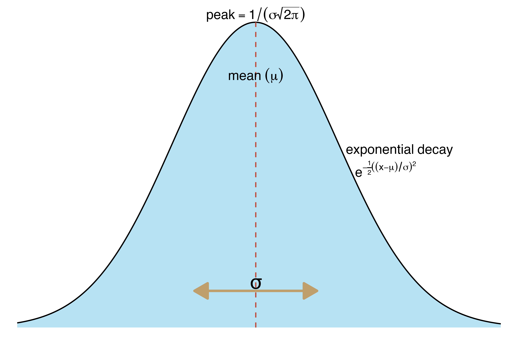

class: inverse, center, large


<h1 style="font-size: 80px; margin-top: 150px;">Beware the Metrics</h1>

<hr style="margin-top: 2em; margin-bottom: 2em;">

--
<h2 style="font-size: 50px;">Misuse and Misunderstanding, Not Math, Mislead</h2>

--
<h2 style="font-size: 40px;">mean ≠ median</h2>

---

## 1. Mean vs Median

### Local bar weath distribution: 50 Patrons
```{r before_plotly, echo=FALSE, message=FALSE, warning=FALSE}
library(knitr)
library(kableExtra)
library(ggplot2)
library(plotly)
library(scales)
library(dplyr)
library(patchwork)

set.seed(123)
wealth_before <- rlnorm(50, meanlog = 11, sdlog = 0.1)

mean_b <- mean(wealth_before)
med_b  <- median(wealth_before)

fill_color   <- "#5A6B80"
edge_color   <- "#3C4756"
mean_color   <- "#C04E3D"
median_color <- "#BFA06D"

annotation_text <- paste0(
  "<span style='color:", mean_color, "'><b>Mean:</b></span> $",
    format(round(mean_b), big.mark = ","), 
  "<br><span style='color:", median_color, "'><b>Median:</b></span> $",
    format(round(med_b),  big.mark = ",")
)

p_before <- ggplot(data.frame(wealth = wealth_before), aes(wealth)) +
  geom_histogram(bins = 20, fill = fill_color, color = edge_color, alpha = 0.7, boundary = 0, closed = "left") +
  geom_vline(xintercept = mean(wealth_before), colour = mean_color,   linewidth = 1,  linetype   = "dashed") +
  geom_vline(xintercept = median(wealth_before), colour = median_color, linewidth = 1, linetype   = "dashed") +
  scale_x_continuous(labels = dollar_format()) +
  scale_y_continuous(expand = c(0,0), limits = c(0,NA),
                     breaks = scales::breaks_pretty(),
                     labels = scales::number_format(accuracy = 1)) +
  labs(title    = "mean ≈ median", x= "wealth (USD)", y = "Count") +
  theme_minimal(base_size = 14) +
  theme(panel.grid.major.y = element_line(color = "grey90"),
        panel.grid.major.x = element_blank(),
        axis.line           = element_line(color = "black"),
        axis.ticks          = element_line(color = "black"),
        axis.ticks.length   = unit(0.2, "cm"),
        plot.title          = element_text(margin = margin(b = 5)))


ggplotly(p_before, height = 450, width = 750) %>%
  layout(
    title = list(
      text    = paste0("mean ≈ median"),
      y       = 0.9, yanchor = "top"
    ),
    margin      = list(t = 100),
    annotations = list(
      list(
        x        = 0.95, y        = 0.9,
        xref     = "paper", yref = "paper",
        text     = annotation_text,
        showarrow= FALSE,
        align    = "right",
        font     = list(size = 18, color = "black")
      )
    )
  )


```

---

## 1. Mean vs Median

### Local bar weath distribution: 50 Patrons + Billon Gezos 
```{r after_plotly, echo=FALSE, message=FALSE, warning=FALSE}


all_wealths <- c(wealth_before, 150e9)
mean_all    <- mean(all_wealths)
med_all     <- median(all_wealths)


annotation_with_bill <- paste0(
  "<span style='color:", mean_color, "'><b>Mean:</b></span> $",
     format(round(mean_all), big.mark = ","),
  "<br><span style='color:", median_color, "'><b>Median:</b></span> $",
     format(round(med_all),  big.mark = ",")
)


p_before <- ggplot(data.frame(wealth = wealth_before), aes(wealth)) +
  geom_histogram(bins = 20, fill = fill_color, color = edge_color, alpha = 0.7, boundary = 0, closed = "left") +
  #geom_vline(xintercept = mean(wealth_before), colour = mean_color,   linewidth = 1) +
  geom_vline(xintercept = median(wealth_before), colour = median_color, linewidth = 1, linetype   = "dashed") +
  scale_x_continuous(labels = dollar_format()) +
  scale_y_continuous(expand = c(0,0), limits = c(0,NA),
                     breaks = scales::breaks_pretty(),
                     labels = scales::number_format(accuracy = 1)) +
  labs(title    = "Wealth Distribution at Your Local Bar",
       subtitle = "mean ≠ median",
       x        = "wealth (USD)", y = "Count") +
  theme_minimal(base_size = 14) +
  theme(panel.grid.major.y = element_line(color = "grey90"),
        panel.grid.major.x = element_blank(),
        axis.line           = element_line(color = "black"),
        axis.ticks          = element_line(color = "black"),
        axis.ticks.length   = unit(0.2, "cm"),
        plot.title          = element_text(margin = margin(b = 5)))

ggplotly(p_before, height = 450, width = 750) %>%
  layout(
    title = list(
      text    = paste0("mean ≠ median"),
      y       = 0.9, yanchor = "top"
    ),
    margin      = list(t = 100),
    annotations = list(
      list(
        x        = 0.95, y        = 0.9,
        xref     = "paper", yref = "paper",
        text     = annotation_with_bill,
        showarrow= FALSE,
        align    = "right",
        font     = list(size = 18, color = "black")
      )
    )
  )
  
```
---

## 1. Mean vs Median


<div style="font-size: 130%; text-align: left; margin: 100px 0;">
  <p><strong>Mean</strong>: Sum of all values divided by the number of values.</p>
  <br>
  <p><strong>Median</strong>: Middle value when the values are ordered.</p>
</div>

---


## 1. Mean vs Median


### Impact of a $150B Outlier on Mean vs. Median — Across Sample Sizes


```{r med_mean_samplesize, echo=FALSE, message=FALSE, warning=FALSE}
df_summary <- readRDS("assets/wealth_with_bill.rds")


df_summary %>%
  mutate(
    `Sample Size` = format(n, big.mark = ","),
    `Mean` = paste0("$", format(round(mean_val), big.mark = ",")),
    `Median` = paste0("$", format(round(median_val), big.mark = ","))
  ) %>%
  select(`Sample Size`, `Mean`, `Median`) %>%
  kable(align = c("r", "r", "r"), booktabs = TRUE) %>%
  kable_styling(font_size = 24, full_width = TRUE
) %>%
  column_spec(2, extra_css = "padding-left: 20px;") %>%
  column_spec(3, extra_css = "padding-left: 20px;")

```


---

## 1. Mean vs Median

A more realistic example


---
.pull-left[
### Economics & Wealth  
- GDP per capita  
- household income  
- net worth  
- home price  
- monthly rent  
- CEO compensation  

### Health & Healthcare  
- life expectancy
- healthcare spending per person  
- hospital bill  
- patient out-of-pocket cost 

]

.pull-right[
### Academics
- test score (SAT, PISA)  
- GPA  
- academic citations
- speaking invitations per expert

### Other
- commute time  
- screen-time per user  
- household energy use  
- carbon emissions per capita  
- YouTube ad revenue per channel
- revenue per app in the App Store
- Software Bug Fix Times
]

---

## 1. Mean vs Median

### Pareto Distribution

```{r pareto_full, echo=FALSE, message=FALSE, warning=FALSE}

library(VGAM)

wealth_pareto <- rpareto(100000, scale = 10000, shape = 1.03)  # shape < 2 → heavy tail


mean_b <- mean(wealth_pareto)
med_b  <- median(wealth_pareto)

annotation_text <- paste0(
  "<span style='color:", mean_color, "'><b>Mean:</b></span> $",
  format(round(mean_b), big.mark = ","), 
  "<br><span style='color:", median_color, "'><b>Median:</b></span> $",
  format(round(med_b),  big.mark = ",")
)

p_pareto <- ggplot(data.frame(wealth = wealth_pareto), aes(wealth)) +
  geom_histogram(bins = 100, fill = fill_color, color = edge_color, alpha = 0.7, boundary = 0, closed = "left") +
  geom_vline(xintercept = mean(wealth_pareto), colour = mean_color,   linewidth = 1,  linetype   = "dashed") +
  geom_vline(xintercept = median(wealth_pareto), colour = median_color, linewidth = 1, linetype   = "dashed") +
  scale_x_continuous(labels = dollar_format()) +
  scale_y_continuous(expand = c(0,0), limits = c(0,NA),
                     breaks = scales::breaks_pretty(),
                     labels = scales::label_comma()) +
  labs(title    = "mean ≠ median", x= "wealth (USD)", y = "Count") +
  theme_minimal(base_size = 14) +
  theme(panel.grid.major.y = element_line(color = "grey90"),
        panel.grid.major.x = element_blank(),
        axis.line           = element_line(color = "black"),
        axis.ticks          = element_line(color = "black"),
        axis.ticks.length   = unit(0.2, "cm"),
        plot.title          = element_text(margin = margin(b = 5)))


ggplotly(p_pareto, height = 450, width = 750) %>%
  layout(
    title = list(
      text    = paste0("mean ≠ median"),
      y       = 0.9, yanchor = "top"
    ),
    margin      = list(t = 100),
    annotations = list(
      list(
        x        = 0.95, y        = 0.9,
        xref     = "paper", yref = "paper",
        text     = annotation_text,
        showarrow= FALSE,
        align    = "right",
        font     = list(size = 18, color = "black")
      )
    )
  )
  
```
  

---

## 1. Mean vs Median

### Pareto Distribution (x-axis limited)


```{r pareto_lim, echo=FALSE, message=FALSE, warning=FALSE}

p_pareto <- ggplot(data.frame(wealth = wealth_pareto), aes(wealth)) +
  geom_histogram(bins = 50, fill = fill_color, color = edge_color, alpha = 0.7, boundary = 0, closed = "left") +
  geom_vline(xintercept = mean(wealth_pareto), colour = mean_color,   linewidth = 1,  linetype   = "dashed") +
  geom_vline(xintercept = median(wealth_pareto), colour = median_color, linewidth = 1, linetype   = "dashed") +
  scale_x_continuous(labels = dollar_format(), limits = c(0, 100000)) +
  scale_y_continuous(expand = c(0,0), limits = c(0,NA),
                     breaks = scales::breaks_pretty(),
                     labels = scales::label_comma()) +
  labs(title    = "mean ≠ median", x= "wealth (USD)", y = "Count") +
  theme_minimal(base_size = 14) +
  theme(panel.grid.major.y = element_line(color = "grey90"),
        panel.grid.major.x = element_blank(),
        axis.line           = element_line(color = "black"),
        axis.ticks          = element_line(color = "black"),
        axis.ticks.length   = unit(0.2, "cm"),
        plot.title          = element_text(margin = margin(b = 5)))


ggplotly(p_pareto, height = 450, width = 750) %>%
  layout(
    title = list(
      text    = paste0("mean ≠ median"),
      y       = 0.9, yanchor = "top"
    ),
    margin      = list(t = 100),
    annotations = list(
      list(
        x        = 0.95, y        = 0.9,
        xref     = "paper", yref = "paper",
        text     = annotation_text,
        showarrow= FALSE,
        align    = "right",
        font     = list(size = 18, color = "black")
      )
    )
  )

```

---

## 1. Mean vs Median

### Normal Distribution


```{r normal_dist, echo=FALSE, message=FALSE, warning=FALSE}

wealth_normal <- rnorm(100000, mean = 90000, sd = 25000)


mean_b <- mean(wealth_normal)
med_b  <- median(wealth_normal)

annotation_text <- paste0(
  "<span style='color:", mean_color, "'><b>Mean:</b></span> $",
  format(round(mean_b), big.mark = ","), 
  "<br><span style='color:", median_color, "'><b>Median:</b></span> $",
  format(round(med_b),  big.mark = ",")
)

p_pareto <- ggplot(data.frame(wealth = wealth_normal), aes(wealth)) +
  geom_histogram(bins = 50, fill = fill_color, color = edge_color, alpha = 0.7, boundary = 0, closed = "left") +
  geom_vline(xintercept = mean(wealth_normal), colour = mean_color,   linewidth = 1) +
  geom_vline(xintercept = median(wealth_normal), colour = median_color, linewidth = 1, linetype   = "dashed") +
  scale_x_continuous(labels = dollar_format()) +
  scale_y_continuous(expand = c(0,0), limits = c(0,NA),
                     breaks = scales::breaks_pretty(),
                     labels = scales::label_comma()) +
  labs(title    = "mean ≈ median", x= "wealth (USD)", y = "Count") +
  theme_minimal(base_size = 14) +
  theme(panel.grid.major.y = element_line(color = "grey90"),
        panel.grid.major.x = element_blank(),
        axis.line           = element_line(color = "black"),
        axis.ticks          = element_line(color = "black"),
        axis.ticks.length   = unit(0.2, "cm"),
        plot.title          = element_text(margin = margin(b = 5)))


ggplotly(p_pareto, height = 450, width = 750) %>%
  layout(
    title = list(
      text    = paste0("mean ≈ median"),
      y       = 0.9, yanchor = "top"
    ),
    margin      = list(t = 100),
    annotations = list(
      list(
        x        = 0.95, y        = 0.9,
        xref     = "paper", yref = "paper",
        text     = annotation_text,
        showarrow= FALSE,
        align    = "right",
        font     = list(size = 18, color = "black")
      )
    )
  )

```

---
## 1. Mean vs Median

<br>

## Extreme Outliers 
<br>

--

## Symmetric vs Skewed
<br>


--


## the Shape of the Data

---
class: inverse, center, large


<h1 style="font-size: 80px; margin-top: 200px;">Distributions</h1>

<hr style="margin-top: 2em; margin-bottom: 2em;">

--
<h2 style="font-size: 60px;">The Foundation Beneath Every Statistic</h2>


---

## 2. Distributions

### Theoretical models of where values are likely to occur

- **Symmetry vs. Skewness**  
  Are values evenly spread around the center, or do they stretch more in one direction?

- **Variability (Spread)**  
  How tightly or widely are the values clustered?

- **Tail Behavior**  
  How likely are extreme or outlier values?

---


---


---

## 2. Distributions


$$
f(x) = \frac{1}{\sigma \sqrt{2\pi}} \, e^{ -\frac{1}{2} \left( \frac{x - \mu}{\sigma} \right)^2 }
$$
Where:
- $\mu$ = the **mean** (center)
- $\sigma$ = the **standard deviation** (spread)
- $x$ = the value at which we evaluate the density
- $f(x)$ = the probability density at $x$ given $\mu$ and $\sigma$


---
.center[
**Normal distribution**
]
$$
f(x) = \frac{1}{\sigma \sqrt{2\pi}} \, e^{ -\frac{1}{2} \left( \frac{x - \mu}{\sigma} \right)^2 }
$$
<hr style="border: 0; height: 1px; background: lightgray;">

<div style="text-align: center;">
  
</div>


---
## 2. Distributions

- Outcomes fall across possibilities

- Those possibilities form a distribution

- Identifying the distribution can shape your analysis

---


class: inverse, center, large


<h1 style="font-size: 80px; margin-top: 150px;">Correlation, Confounding, Causation</h1>

<hr style="margin-top: 2em; margin-bottom: 2em;">

--
<h2 style="font-size: 80px;">and the Stories We Tell</h2>


---
class: inverse, center, large, middle

<h1 style="font-size: 80px; ">Correlation</h1>

---


---


---
class: inverse, center, large, middle

<h1 style="font-size: 80px; ">Confounding</h1>

---


```{r shoes, fig.width=4, fig.height=3, echo=FALSE, message=FALSE, warning=FALSE}

format_p <- function(p) {
  if (p < 0.001) {
    "< 0.001"
  } else {
    round(p, 3)
  }
}


set.seed(123)
n      <- 500
age    <- sample(1:18, n, replace = TRUE)            
shoe   <- rnorm(n, mean = 1.5 * age + 10, sd = 2)   
shoe   <- round(shoe * 2) / 2   # Round to nearest half-size

reading<- rnorm(n, mean = 5 * age + 20, sd = 20)     
df <- tibble(age, shoe, reading)

model_shoe <- lm(reading ~ shoe, data = df)

model_age <- lm(reading ~ age, data = df)

model_both <- lm(reading ~ shoe + age, data = df)

```

.pull-left[

```{r, shoes_reading, fig.width=5, fig.height=4, echo=FALSE, message=FALSE, warning=FALSE}
p_reading = ggplot(df, aes(shoe, reading)) +
  geom_point(alpha = 0.5) +
  geom_smooth(method = "lm", se = FALSE, color = "blue") +
  labs(title = "Shoe Size vs Reading Score") +
  theme_minimal()

ggplotly(p_reading) %>%
  config(displayModeBar = FALSE)

```

- Model: `reading ~ shoe size`
- Model p-value (shoe): `r broom::tidy(model_shoe) %>% filter(term == "shoe") %>% pull(p.value) %>% format_p()`

]


---

.pull-left[

```{r, shoes_reading2, fig.width=5, fig.height=4, echo=FALSE, message=FALSE, warning=FALSE}
p_reading = ggplot(df, aes(shoe, reading)) +
  geom_point(alpha = 0.5) +
  geom_smooth(method = "lm", se = FALSE, color = "blue") +
  labs(title = "Shoe Size vs Reading Score") +
  theme_minimal()

ggplotly(p_reading) %>%
  config(displayModeBar = FALSE)

```

- Model: `reading ~ shoe size`
- Model p-value (shoe): `r broom::tidy(model_shoe) %>% filter(term == "shoe") %>% pull(p.value) %>% format_p()`
]

.pull-right[

```{r, age_reading, fig.width=5, fig.height=4, echo=FALSE, message=FALSE, warning=FALSE}
p_age = ggplot(df, aes(age, reading)) +
  geom_point(alpha = 0.5) +
  geom_smooth(method = "lm", se = FALSE, color = "red") +
  labs(title = "Age vs Reading Score") +
  theme_minimal()

ggplotly(p_age) %>%
  config(displayModeBar = FALSE)

```

- Model: `reading ~ age`
- Model p-value (age): `r broom::tidy(model_age) %>% filter(term == "age") %>% pull(p.value) %>% format_p()`
]

---


.pull-left[

```{r, shoes_reading3, fig.width=5, fig.height=4, echo=FALSE, message=FALSE, warning=FALSE}
p_reading = ggplot(df, aes(shoe, reading)) +
  geom_point(alpha = 0.5) +
  geom_smooth(method = "lm", se = FALSE, color = "blue") +
  labs(title = "Shoe Size vs Reading Score") +
  theme_minimal()

ggplotly(p_reading) %>%
  config(displayModeBar = FALSE)

```

- Model: `reading ~ shoe size`
- Model p-value (shoe): `r broom::tidy(model_shoe) %>% filter(term == "shoe") %>% pull(p.value) %>% format_p()`

]

.pull-right[

```{r, age_reading2, fig.width=5, fig.height=4, echo=FALSE, message=FALSE, warning=FALSE}
p_age = ggplot(df, aes(age, reading)) +
  geom_point(alpha = 0.5) +
  geom_smooth(method = "lm", se = FALSE, color = "red") +
  labs(title = "Age vs Reading Score") +
  theme_minimal()

ggplotly(p_age) %>%
  config(displayModeBar = FALSE)

```

- Model: `reading ~ age`
- Model p-value (age): `r broom::tidy(model_age) %>% filter(term == "age") %>% pull(p.value) %>% format_p()`
]
<hr style="border: 0; height: 1px; background: lightgray;">
.center[
Combined Model: `reading ~ shoe + age`

```{r, output_model, echo=FALSE, message=FALSE, warning=FALSE}
shoe_p <- broom::tidy(model_both) %>% filter(term == "shoe") %>% pull(p.value) %>% format_p()
age_p  <- broom::tidy(model_both) %>% filter(term == "age") %>% pull(p.value) %>% format_p()
```

Shoe p-value: `r shoe_p`; Age p-value: **`r age_p`**

> **Result:** Once age is included, shoe size is no longer significant
]


---
class: inverse, center, large, middle

<h1 style="font-size: 80px; ">Causality</h1>


---

.pull-left[
### Core Principles

- **Control:** Hold all other variables constant
- **Manipulation:** Apply a treatment or intervention
- **Randomization:** Assign subjects to treatment/control by chance
- **Comparison:** Measure differences in outcomes between groups

> **Key Idea:**  
> Experimental design isolates the **effect** of a specific factor  
> by eliminating alternative explanations.
]

.pull-right[
```{r, causality, fig.width=4.5, fig.height=4, echo=FALSE, message=FALSE, warning=FALSE, fig.cap="Compare outcomes between randomized groups to estimate causal effect"}
library(ggplot2)
library(dplyr)

# Conceptual RCT-like schematic
df_exp <- tibble(
  group = rep(c("Control", "Treatment"), each = 5),
  outcome = c(5, 6, 5, 6, 5,   # control outcomes
              8, 9, 7, 9, 8),  # treatment outcomes
  id = 1:10
)

p_cause = ggplot(df_exp, aes(x = group, y = outcome)) +
  geom_jitter(width = 0.1, height = 0, size = 3, alpha = 0.7) +
  stat_summary(fun = mean, geom = "crossbar", width = 0.5, color = "red", fatten = 2) +
  labs(
    title = "Simplified Experimental Setup",
    y = "Outcome",
    x = ""
  ) +
  theme_minimal(base_size = 12)

ggplotly(p_cause) %>%
  config(displayModeBar = FALSE)

```
]


.center[
> Experiments test causality by manipulating one factor,  
> holding everything else constant, and comparing outcomes.
]

---
class: inverse, center, large, middle

<h1 style="font-size: 80px; ">The Stories We Tell</h1>

---
```{r veg_oil, echo=FALSE, message=FALSE, warning=FALSE}

df <- read.csv("assets/heart_disease_fat_oil_approx.csv")


# View the first few rows

df[df == "NA"] <- NA
df <- data.frame(lapply(df, function(x) as.numeric(as.character(x))))

# Access columns as vectors
years <- df$year
sat_fat <- df$sat_fat_g_per_capita
veg_oil <- df$veg_oil_g_per_capita
heart_disease <- df$heart_disease_deaths_000s
total_calories = df$total_calories

cor_satfat <- round(cor(heart_disease, sat_fat, use = "complete.obs"), 2)
cor_vegoil <- round(cor(heart_disease, veg_oil, use = "complete.obs"), 2)
cor_total_cal <- round(cor(heart_disease, total_calories, use = "complete.obs"), 2)

# Plot
plot_ly(width = 800, height = 550) %>%
  add_lines(x = years, y = sat_fat, name = "Saturated Fat (g/day)", yaxis = "y", line = list(color = "purple", width = 5)) %>%
  add_lines(x = years, y = veg_oil, name = "Vegetable Oil (g/day)", yaxis = "y", line = list(color = "black", width = 5)) %>%
  add_lines(x = years, y = heart_disease, name = "Heart Disease Deaths (thousands)", yaxis = "y2", line = list(color = "red", width = 5)) %>%
  layout(
    title = list(text = "<b>Heart Disease Deaths, Saturated Fat, Vegetable Oil</b>", y = 0.95, font = list(size=22)),
    xaxis = list(title = "", showgrid = TRUE, zeroline = FALSE,showline = FALSE, linecolor = "black"),
    margin = list(r = 80, t=60, l=40),
    yaxis = list(
      title = "Grams Per Capita Per Day",
      showgrid = TRUE,
      gridcolor = "lightgray",
      showgrid = FALSE,
      zeroline = FALSE,
      showline = FALSE,
      linecolor = "black",
      titlefont = list(size = 14)
    ),
    yaxis2 = list(
      title = "Heart Disease Deaths (Thousands)",
      overlaying = "y",
      side = "right",
      showgrid = FALSE,
      zeroline = FALSE,
      showline = FALSE, 
      titlefont = list(size = 14, color = "red"),
      tickfont = list(color = "red"),
      title_standoff = 100
    ),annotations = list(
      list(
        x = 0.01, y = .92, xref = "paper", yref = "paper",
        text = paste0("Corr (Heart Disease, Saturated Fat): ", cor_satfat),
        showarrow = FALSE, font = list(size = 14, color = "purple")
      ),
      list(
        x = 0.01, y = .87, xref = "paper", yref = "paper",
        text = paste0("Corr (Heart Disease, Vegetable Oil): ", cor_vegoil),
        showarrow = FALSE, font = list(size = 14, color = "black")
      )
    ),
    legend = list(orientation = "h", x = 0.1, y = -0.05)
  )

```

<small style="font-size:12px; line-height:1.1; display:inline-block;">
"Figure 2 correlates saturated fat and total vegetable oil consumption versus heart disease deaths in the U.S.A., with data on all three dating back to at least 1909."</small>
<small style="font-size:12px; line-height:1; display:inline-block;">
Data: <a href="https://www.fns.usda.gov/cnpp/us-foodsupply/nutrient-content-1909-2010">USDA Food Supply</a> |
Paper: <a href="https://www.sciencedirect.com/science/article/abs/pii/S0306987717305017?via%3Dihub">ScienceDirect</a> |
Video: <a href="https://www.youtube.com/watch?v=7kGnfXXIKZM">YouTube</a>
</small>

---

## 4. Linear and Non-Linear Effects

---

## 5. Bias

**Bias** is the difference between the expected value of an estimator and the true value of the parameter it estimates.

Formally:

$$
\text{Bias}(\hat{\theta}) = \mathbb{E}[\hat{\theta}] - \theta
$$

Where:
- $\hat{\theta}$ = the **estimator** (your calculated estimate)
- $\theta$ = the **true parameter** (the real value you want)
- $\mathbb{E}[\hat{\theta}]$ = the **expected value** of the estimator (its long-run average over many samples)


- If Bias = 0 → the estimator is **unbiased**.

- If Bias ≠ 0 → the estimator is **biased** (systematically too high or too low).

---

Bias doesn’t just shift your first guess.
It filters what you see next — making you even more biased over time


Selection bias: The sample is not representative of the population.

Omitted variable bias: Leaving out a variable that influences both the dependent and independent variables.

Measurement bias (or information bias): Errors in how data is collected or recorded.

Survivorship bias: Only analyzing "survivors" or those who remain, ignoring those who dropped out or failed.

Recall bias: Errors because people remember things inaccurately (common in surveys and retrospective studies).

Observer bias: Researcher's expectations subtly influence measurements or observations.

Publication bias: Studies with "positive" results are more likely to be published than "null" or "negative" results.

---

## 5. Bias

### The Self-Reinforcing Feedback Loop of Bias


```{r bias-feedback-loop1, echo=FALSE, message=FALSE, warning=FALSE}
library(DiagrammeR)
library(htmltools)

graph <- grViz("
digraph bias_loop {

  graph [layout = circo]
  node [shape = box, style = \"rounded,filled\", fontname = Helvetica, fontsize=12]

  # Node Colors
  CurrentBias [label = 'Current Bias', fillcolor = '#F5C4BB']        # lightest red
  SelectiveAttention [label = 'Selective Attention', fillcolor = '#EDA89C'] # medium-light
  SelectiveEvidence [label = 'Selective Evidence', fillcolor = '#E17A66']   # medium
  ReinforcedBias [label = 'Reinforced Bias', fillcolor = '#C04E3D']          # strong bias (your mean_color)

  edge [penwidth = 2]

  CurrentBias -> SelectiveAttention
  SelectiveAttention -> SelectiveEvidence
  SelectiveEvidence -> ReinforcedBias
  ReinforcedBias -> CurrentBias
}
")

graph


```

---

### Consequence of the Self-Reinforcing Feedback Loop of Bias

Conceptual Edition

```{r bias-feedback-loop3, echo=FALSE, message=FALSE, warning=FALSE}

library(dplyr)
library(tibble)
library(plotly)

time          <- 0:50
r             <- 0.07
truth_vals    <- rep(0, length(time))
estimate_vals <- (1 + r)^time


cum_df <- bind_rows(lapply(time, function(t) {
  tibble(
    time_point = rep(0:t, 2),
    value      = c(truth_vals[1:(t + 1)],
                   estimate_vals[1:(t + 1)]),
    series     = rep(c("Actual Value (Truth)", "Perceived Value (Biased)"), each = t + 1),
    frame      = t
  )
}))

dot_df <- tibble(
  time_point = c(0, 0),
  value      = c(truth_vals[1], estimate_vals[1]),
  series     = c("Actual Value (Truth)", "Perceived Value (Biased)"),
  frame      = 0
)

plot_ly(width = 700, height = 500) %>%
  # show only the two starting dots at frame 0
  add_markers(
    data       = dot_df,
    x          = ~time_point, y = ~value, frame = ~frame, ids = ~series,
    color      = ~series,
    colors     = c("Actual Value (Truth)" = median_color, "Perceived Value (Biased)" = mean_color),
    marker     = list(size = 12),
    showlegend = FALSE
  ) %>%
  # animate two lines (one per series) across frames
  add_lines(
    data        = cum_df,
    x           = ~time_point, y = ~value, frame = ~frame, ids = ~series,
    color       = ~series,
    colors      = c("Actual Value (Truth)" = median_color, "Perceived Value (Biased)" = mean_color),
    legendgroup = ~series,
    line        = list(width = 4,shape="spline", smoothing=1.3)
  ) %>%
  layout(
    title = list(text = NULL),
    margin      = list(t = 50, r=25),
    xaxis  = list(showline       = TRUE,
                  zeroline       = FALSE,
                  showticklabels = FALSE,
                  title = "Time / Reinforcement cycles",
                  ticks          = ""),
    yaxis  = list(showline       = TRUE,
                  zeroline       = FALSE,
                  showticklabels = FALSE,
                  title = "Bias",
                  ticks          = ""),
    legend = list(orientation = "h", x = 0.25, y = 1.1)
  ) %>%
  animation_opts(
    frame      = 33,
    transition = 30,
    easing     = "linear",
    redraw     = FALSE
  ) %>%
  animation_slider(currentvalue = list(prefix = "Time "))


```


---


### Consequence of the Self-Reinforcing Feedback Loop of Bias

Carnivore Edition

```{r bias-feedback-carni2, echo=FALSE, message=FALSE, warning=FALSE}
## parameters -----------------------------------------------------------
time          <- 0:50
r             <- 0.07
truth_vals    <- rep(0, length(time))
estimate_vals <- (1 + r)^time


cum_df <- bind_rows(lapply(time, function(t) {
  tibble(
    time_point = rep(0:t, 2),
    value      = c(truth_vals[1:(t + 1)],
                   estimate_vals[1:(t + 1)]),
    series     = rep(c("Reality (Unbiased)", "Perceived Certainty (Biased)"), each = t + 1),
    frame      = t
  )
}))

dot_df <- tibble(
  time_point = c(0, 0),
  value      = c(truth_vals[1], estimate_vals[1]),
  series     = c("Reality (Unbiased)", "Perceived Certainty (Biased)"),
  frame      = 0
)

## static plot ----------------------------------------------------------
plot_ly(width = 750, height = 500) %>%
  # plot the two starting dots
  add_markers(
    data       = dot_df,
    x          = ~time_point, y = ~value, color = ~series,
    colors     = c("Reality (Unbiased)" = median_color, "Perceived Certainty (Biased)" = mean_color),
    marker     = list(size = 12),
    showlegend = FALSE
  ) %>%
  # plot the full two lines
  add_lines(
    data        = cum_df,
    x           = ~time_point, y = ~value, color = ~series,
    colors      = c("Reality (Unbiased)" = median_color, "Perceived Certainty (Biased)" = mean_color),
    legendgroup = ~series,
    line        = list(width = 4, shape = "spline", smoothing = 1.3)
  ) %>%
  layout(
    title = list(text = NULL),
    margin      = list(t = 50, r=25),
    xaxis  = list(showline       = TRUE,
                  zeroline       = FALSE,
                  showticklabels = FALSE,
                  title = "Time / Reinforcement cycles",
                  ticks          = ""),
    yaxis  = list(showline       = TRUE,
                  zeroline       = FALSE,
                  showticklabels = FALSE,
                  title = "Bias",
                  ticks          = ""),
    legend = list(orientation = "h", x = 0.15, y = 1.05)
  ) %>%  layout(
    shapes = list(
      list(
        type = "line", x0 = 1, x1 = 1,
        y0 = 0, y1 = max(estimate_vals) * 1.05,
        line = list(color = "gray", dash = "dot", width = 2)
      ),
      list(
        type = "line", x0 = 5, x1 = 5,
        y0 = 0, y1 = max(estimate_vals) * 1.05,
        line = list(color = "gray", dash = "dot", width = 2)
      ),
      list(
        type = "line", x0 = 15, x1 = 15,
        y0 = 0, y1 = max(estimate_vals) * 1.05,
        line = list(color = "gray", dash = "dot", width = 2)
      ),
      list(
        type = "line", x0 = 25, x1 = 25,
        y0 = 0, y1 = max(estimate_vals) * 1.05,
        line = list(color = "gray", dash = "dot", width = 2)
      ),
      list(
        type = "line", x0 = 35, x1 = 35,
        y0 = 0, y1 = max(estimate_vals) * 1.05,
        line = list(color = "gray", dash = "dot", width = 2)
      ),
      list(
        type = "line", x0 = 45, x1 = 45,
        y0 = 0, y1 = max(estimate_vals) * 1.05,
        line = list(color = "gray", dash = "dot", width = 2)
      ),
      list(
        type = "line", x0 = 50, x1 = 50,
        y0 = 0, y1 = max(estimate_vals) * 1.05,
        line = list(color = "gray", dash = "dot", width = 2)
      )
    )
  ) %>%
  layout(
    annotations = list(
      list(
        x = 1, y = max(estimate_vals) * 0.1,
        text = "TikTok:\nMeat = Superfood", align = "left",
        showarrow = FALSE, font = list(size = 12), xanchor = "left"
      ),
      list(
        x = 5, y = max(estimate_vals) * 0.25,
        text = "Plants Are\nTrying to\nKill You", align = "left",
        showarrow = FALSE, font = list(size = 12), xanchor = "left"
      ),
      list(
        x = 15, y = max(estimate_vals) * 0.375,
        text = "Only Trust\nCarnivore\nSources", align = "left",
        showarrow = FALSE, font = list(size = 12), xanchor = "left"
      ),
      list(
        x = 25, y = max(estimate_vals) * 0.5,
        text = "Fiber\n=\nIndustry Scam", align = "left",
        showarrow = FALSE, font = list(size = 12), xanchor = "left"
      ),
      list(
        x = 35, y = max(estimate_vals) * 0.625,
        text = "Counter-evidence\n=\nConspiracy ", align = "left",
        showarrow = FALSE, font = list(size = 12), xanchor = "left"
      ),
      list(
        x = 45, y = max(estimate_vals) * 0.8,
        text = "Humans\n=\nCarnivores", align = "left",
        showarrow = FALSE, font = list(size = 12), xanchor = "left"
      ),
      list(
        x = 50, y = max(estimate_vals) * 1,
        text = "Raw\nOrgans\nOnly", align = "left",
        showarrow = FALSE, font = list(size = 12), xanchor = "left"
      )
    )
  )
```

---


### Consequence of the Self-Reinforcing Feedback Loop of Bias

Vegan Edition

```{r bias-feedback-vegan2, echo=FALSE, message=FALSE, warning=FALSE}

plot_ly(width = 750, height = 500) %>%
  # plot the two starting dots
  add_markers(
    data       = dot_df,
    x          = ~time_point, y = ~value, color = ~series,
    colors     = c("Reality (Unbiased)" = median_color, "Perceived Certainty (Biased)" = mean_color),
    marker     = list(size = 12),
    showlegend = FALSE
  ) %>%
  # plot the full two lines
  add_lines(
    data        = cum_df,
    x           = ~time_point, y = ~value, color = ~series,
    colors      = c("Reality (Unbiased)" = median_color, "Perceived Certainty (Biased)" = mean_color),
    legendgroup = ~series,
    line        = list(width = 4, shape = "spline", smoothing = 1.3)
  ) %>%
  layout(
    title = list(text = NULL),
    margin      = list(t = 50, r=25),
    xaxis  = list(showline       = TRUE,
                  zeroline       = FALSE,
                  showticklabels = FALSE,
                  title = "Time / Reinforcement cycles",
                  ticks          = ""),
    yaxis  = list(showline       = TRUE,
                  zeroline       = FALSE,
                  showticklabels = FALSE,
                  title = "Bias",
                  ticks          = ""),
    legend = list(orientation = "h", x = 0.15, y = 1.05)
  ) %>%  layout(
    shapes = list(
      list(
        type = "line", x0 = 1, x1 = 1,
        y0 = 0, y1 = max(estimate_vals) * 1.05,
        line = list(color = "gray", dash = "dot", width = 2)
      ),
      list(
        type = "line", x0 = 5, x1 = 5,
        y0 = 0, y1 = max(estimate_vals) * 1.05,
        line = list(color = "gray", dash = "dot", width = 2)
      ),
      list(
        type = "line", x0 = 15, x1 = 15,
        y0 = 0, y1 = max(estimate_vals) * 1.05,
        line = list(color = "gray", dash = "dot", width = 2)
      ),
      list(
        type = "line", x0 = 25, x1 = 25,
        y0 = 0, y1 = max(estimate_vals) * 1.05,
        line = list(color = "gray", dash = "dot", width = 2)
      ),
      list(
        type = "line", x0 = 35, x1 = 35,
        y0 = 0, y1 = max(estimate_vals) * 1.05,
        line = list(color = "gray", dash = "dot", width = 2)
      ),
      list(
        type = "line", x0 = 45, x1 = 45,
        y0 = 0, y1 = max(estimate_vals) * 1.05,
        line = list(color = "gray", dash = "dot", width = 2)
      ),
      list(
        type = "line", x0 = 50, x1 = 50,
        y0 = 0, y1 = max(estimate_vals) * 1.05,
        line = list(color = "gray", dash = "dot", width = 2)
      )
    )
  ) %>%
layout(
  annotations = list(
    list(
      x = 1, y = max(estimate_vals) * 0.1,
      text = "TikTok:\nPlants = Superfoods", align = "left",
      showarrow = FALSE, font = list(size = 12), xanchor = "left"
    ),
    list(
      x = 5, y = max(estimate_vals) * 0.25,
      text = "Meat Rots\nin Your\nColon", align = "left",
      showarrow = FALSE, font = list(size = 12), xanchor = "left"
    ),
    list(
      x = 15, y = max(estimate_vals) * 0.375,
      text = "Only Trust\nVegan\nSources", align = "left",
      showarrow = FALSE, font = list(size = 12), xanchor = "left"
    ),
    list(
      x = 25, y = max(estimate_vals) * 0.5,
      text = "Protein deficiency\n=\nIndustry Scam", align = "left",
      showarrow = FALSE, font = list(size = 12), xanchor = "left"
    ),
    list(
      x = 35, y = max(estimate_vals) * 0.625,
      text = "Counter-evidence\n=\nConspiracy", align = "left",
      showarrow = FALSE, font = list(size = 12), xanchor = "left"
    ),
    list(
      x = 45, y = max(estimate_vals) * 0.8,
      text = "Humans\n=\nVegans", align = "left",
      showarrow = FALSE, font = list(size = 12), xanchor = "left"
    ),
    list(
      x = 50, y = max(estimate_vals) * 1,
      text = "Raw\nFruit\nOnly", align = "left",
      showarrow = FALSE, font = list(size = 12), xanchor = "left"
    )
  )
) 
```