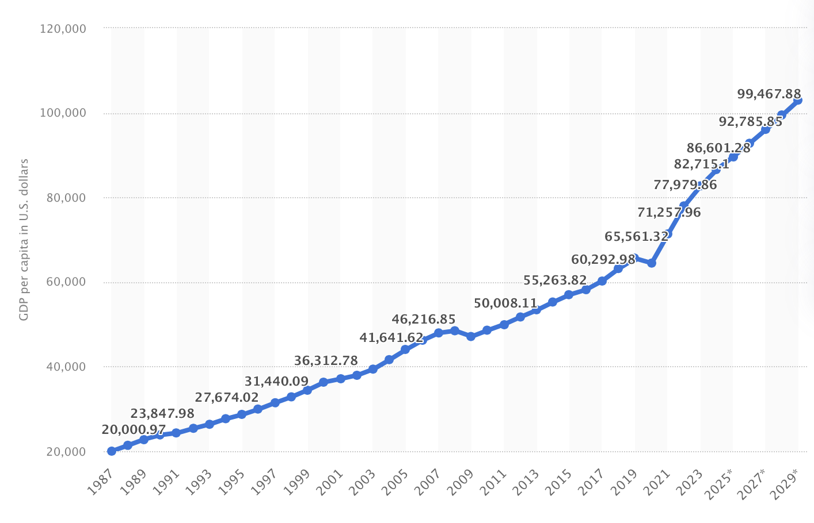
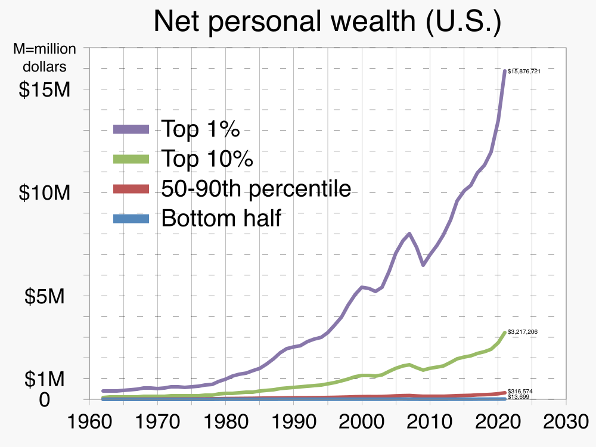

class: inverse, center, large


<h1 style="font-size: 100px; margin-top: 50px; font-family: Georgia, serif;">I</h1>

<h1 style="font-size: 80px; margin-top: 75px;">Neutral Metrics</h1>

<hr style="margin-top: 2em; margin-bottom: 2em;">

--
<h2 style="font-size: 50px;">Misuse and Misunderstandings Mislead</h2>

--
<h2 style="font-size: 40px;">mean ≠ median</h2>

---

## 1. Neutral Metrics: Mean vs Median

### Local bar weath distribution: 50 Patrons
```{r before_plotly, echo=FALSE, message=FALSE, warning=FALSE}

library(knitr)
library(kableExtra)
library(ggplot2)
library(plotly)
library(scales)
library(dplyr)
library(patchwork)

set.seed(123)
wealth_before <- rlnorm(50, meanlog = 11, sdlog = 0.1)

mean_b <- mean(wealth_before)
med_b  <- median(wealth_before)

fill_color   <- "#5A6B80"
edge_color   <- "#3C4756"
mean_color   <- "#C04E3D"
median_color <- "#BFA06D"

txt <- scales::comma
ann <- list(
  list(x=0.96, y=0.94, xref='paper', yref='paper',
       text=sprintf("<b>Mean:</b> $%s", txt(round(mean_b))),
       font=list(size=18, color=mean_color), showarrow=FALSE, align='right'),
  list(x=0.96, y=0.86, xref='paper', yref='paper',
       text=sprintf("<b>Median:</b> $%s", txt(round(med_b))),
       font=list(size=18, color=median_color), showarrow=FALSE, align='right')
)

p_before <- ggplot(data.frame(wealth = wealth_before), aes(wealth)) +
  geom_histogram(bins = 20, fill = fill_color, color = edge_color, alpha = 0.7, boundary = 0, closed = "left") +
  geom_vline(xintercept = mean(wealth_before), colour = mean_color,   linewidth = 1,  linetype   = "dashed") +
  geom_vline(xintercept = median(wealth_before), colour = median_color, linewidth = 1, linetype   = "dashed") +
  scale_x_continuous(labels = dollar_format()) +
  scale_y_continuous(expand = c(0,0), limits = c(0,NA),
                     breaks = scales::breaks_pretty(),
                     labels = scales::number_format(accuracy = 1)) +
  labs(title    = "mean ≈ median", x= "wealth (USD)", y = "Count") +
  theme_minimal(base_size = 14) +
  theme(panel.grid.major.y = element_line(color = "grey90"),
        panel.grid.major.x = element_blank(),
        axis.line           = element_line(color = "black"),
        axis.ticks          = element_line(color = "black"),
        axis.ticks.length   = unit(0.2, "cm"),
        plot.title          = element_text(margin = margin(b = 5)))


ggplotly(p_before, height = 450, width = 750) %>%
  
  layout(
    title = list(
      text    = paste0("mean ≈ median"),
      y       = 0.9, yanchor = "top"
    ),
    margin      = list(t = 100),
    annotations = ann
  )


```

---

## 1. Neutral Metrics: Mean vs Median

### Local bar weath distribution: 50 Patrons + Billon Gezosberg

```{r after_plotly, echo=FALSE, message=FALSE, warning=FALSE}


all_wealths <- c(wealth_before, 150e9)
mean_all    <- mean(all_wealths)
med_all     <- median(all_wealths)


txt <- scales::comma

ann <- list(
  list(x=0.96, y=0.94, xref='paper', yref='paper',
       text=sprintf("<b>Mean:</b> $%s", txt(round(mean_all))),
       font=list(size=18, color=mean_color), showarrow=FALSE, align='right'),
  list(x=0.96, y=0.86, xref='paper', yref='paper',
       text=sprintf("<b>Median:</b> $%s", txt(round(med_all))),
       font=list(size=18, color=median_color), showarrow=FALSE, align='right')
)

p_before <- ggplot(data.frame(wealth = wealth_before), aes(wealth)) +
  geom_histogram(bins = 20, fill = fill_color, color = edge_color, alpha = 0.7, boundary = 0, closed = "left") +
  #geom_vline(xintercept = mean(wealth_before), colour = mean_color,   linewidth = 1) +
  geom_vline(xintercept = med_all, colour = median_color, linewidth = 1, linetype   = "dashed") +
  scale_x_continuous(labels = dollar_format()) +
  scale_y_continuous(expand = c(0,0), limits = c(0,NA),
                     breaks = scales::breaks_pretty(),
                     labels = scales::number_format(accuracy = 1)) +
  labs(title    = "Wealth Distribution at Your Local Bar",
       subtitle = "mean ≠ median",
       x        = "wealth (USD)", y = "Count") +
  theme_minimal(base_size = 14) +
  theme(panel.grid.major.y = element_line(color = "grey90"),
        panel.grid.major.x = element_blank(),
        axis.line           = element_line(color = "black"),
        axis.ticks          = element_line(color = "black"),
        axis.ticks.length   = unit(0.2, "cm"),
        plot.title          = element_text(margin = margin(b = 5)))


ggplotly(p_before, height = 450, width = 750) %>%
  
  layout(
    title = list(
      text    = paste0("mean ≠ median"),
      y       = 0.9, yanchor = "top"
    ),
    margin      = list(t = 100),
    annotations = ann
  )

  
```
---

## 1. Neutral Metrics: Mean vs Median


<div style="font-size: 130%; text-align: left; margin: 100px 0;">
  <p><strong>Mean</strong>: Sum of all values divided by the number of values.</p>
  <br>
  <p><strong>Median</strong>: Middle value when the values are ordered.</p>
</div>

---


## 1. Neutral Metrics: Mean vs Median


### Impact of a $150B Outlier on Mean vs. Median — Across Sample Sizes


```{r med_mean_samplesize, echo=FALSE, message=FALSE, warning=FALSE}
df_summary <- readRDS("assets/wealth_with_bill.rds")


df_summary %>%
  mutate(
    `Sample Size` = format(n, big.mark = ","),
    `Mean` = paste0("$", format(round(mean_val), big.mark = ",")),
    `Median` = paste0("$", format(round(median_val), big.mark = ","))
  ) %>%
  select(`Sample Size`, `Mean`, `Median`) %>%
  kable(align = c("r", "r", "r"), booktabs = TRUE) %>%
  kable_styling(font_size = 24, full_width = TRUE
) %>%
  column_spec(2, extra_css = "padding-left: 20px;") %>%
  column_spec(3, extra_css = "padding-left: 20px;")

```


---

## 1. Neutral Metrics: Mean vs Median

A more realistic example


---
.pull-left[
### Economics & Wealth  
- GDP per capita  
- household income  
- net worth  
- home price  
- CEO compensation
- inheritance amounts

### Health & Healthcare  
- life expectancy
- healthcare spending per person  
- hospital bill  
- hospital stay length
- ER wait times

]

.pull-right[
### Reputation & Influence
- followers per influencer
- YouTube ad revenue per channel
- book sales per author
- academic citations
- speaking invitations per expert

### Other
- commute time  
- screen-time per user  
- household energy use  
- carbon emissions per capita  
- revenue per app 
- software bug fix times
]

---

## 1. Neutral Metrics: Mean vs Median

#### Gross Domestic Product - GDP

`GDP = C + I + G + (X−M)`  
**C** is consumer spending, **I** is business investment, **G** is government spending, and (**X−M**) is net exports ([Investopedia](https://www.investopedia.com/articles/investing/051415/how-calculate-gdp-country.asp)).

GDP per capita = GDP ÷ population = **average** output per person

.pull-left[
<center>
U.S. GDP per Capita<br>
<br>
<span style="font-size: 50%;">
<a href="https://www.statista.com/statistics/263601/gross-domestic-product-gdp-per-capita-in-the-united-states/">statista</a>
</span>
</center>
]

---

## 1. Neutral Metrics: Mean vs Median

#### Gross Domestic Product - GDP

`GDP = C + I + G + (X−M)`  
**C** is consumer spending, **I** is business investment, **G** is government spending, and (**X−M**) is net exports ([Investopedia](https://www.investopedia.com/articles/investing/051415/how-calculate-gdp-country.asp)).

GDP per capita = GDP ÷ population = **average** output per person

.pull-left[
<center>
U.S. GDP per Capita<br>
<br>
<span style="font-size: 50%;">
<a href="https://www.statista.com/statistics/263601/gross-domestic-product-gdp-per-capita-in-the-united-states/">statista</a>
</span>
</center>
]


.pull-right[
<center>
<br>
<span style="font-size: 50%;">
By <a href="//commons.wikimedia.org/wiki/User:RCraig09" title="User:RCraig09">RCraig09</a> - <span>Own work</span>, 
<a href="https://creativecommons.org/licenses/by-sa/4.0" title="Creative Commons Attribution-Share Alike 4.0">CC BY-SA 4.0</a>, 
<a href="https://commons.wikimedia.org/w/index.php?curid=137146870">Link</a>
</span>
</center>
]

---
## 1. Neutral Metrics: Mean vs Median

### Pareto Distribution

```{r pareto_full, echo=FALSE, message=FALSE, warning=FALSE}

library(VGAM)

wealth_pareto <- rpareto(100000, scale = 10000, shape = 1.03)  # shape < 2 → heavy tail


mean_pareto <- mean(wealth_pareto)
med_pareto  <- median(wealth_pareto)

txt <- scales::comma
ann <- list(
  list(x=0.96, y=0.94, xref='paper', yref='paper',
       text=sprintf("<b>Mean:</b> $%s", txt(round(mean_pareto))),
       font=list(size=18, color=mean_color), showarrow=FALSE, align='right'),
  list(x=0.96, y=0.86, xref='paper', yref='paper',
       text=sprintf("<b>Median:</b> $%s", txt(round(med_pareto))),
       font=list(size=18, color=median_color), showarrow=FALSE, align='right')
)

p_pareto <- ggplot(data.frame(wealth = wealth_pareto), aes(wealth)) +
  geom_histogram(bins = 100, fill = fill_color, color = edge_color, alpha = 0.7, boundary = 0, closed = "left") +
  geom_vline(xintercept = mean_pareto, colour = mean_color,   linewidth = 1,  linetype   = "dashed") +
  geom_vline(xintercept = med_pareto, colour = median_color, linewidth = 1, linetype   = "dashed") +
  scale_x_continuous(labels = dollar_format()) +
  scale_y_continuous(expand = c(0,0), limits = c(0,NA),
                     breaks = scales::breaks_pretty(),
                     labels = scales::label_comma()) +
  labs(title    = "mean ≠ median", x= "wealth (USD)", y = "Count") +
  theme_minimal(base_size = 14) +
  theme(panel.grid.major.y = element_line(color = "grey90"),
        panel.grid.major.x = element_blank(),
        axis.line           = element_line(color = "black"),
        axis.ticks          = element_line(color = "black"),
        axis.ticks.length   = unit(0.2, "cm"),
        plot.title          = element_text(margin = margin(b = 5)))


ggplotly(p_pareto, height = 450, width = 750) %>%
  layout(
    title = list(
      text    = paste0("mean ≠ median"),
      y       = 0.9, yanchor = "top"
    ),
    margin      = list(t = 100),
    annotations = ann
  )
  
```
  

---

## 1. Neutral Metrics: Mean vs Median

### Pareto Distribution (x-axis limited)


```{r pareto_lim, echo=FALSE, message=FALSE, warning=FALSE}

p_pareto <- ggplot(data.frame(wealth = wealth_pareto), aes(wealth)) +
  geom_histogram(bins = 50, fill = fill_color, color = edge_color, alpha = 0.7, boundary = 0, closed = "left") +
  geom_vline(xintercept = mean(wealth_pareto), colour = mean_color,   linewidth = 1,  linetype   = "dashed") +
  geom_vline(xintercept = median(wealth_pareto), colour = median_color, linewidth = 1, linetype   = "dashed") +
  scale_x_continuous(labels = dollar_format(), limits = c(0, 100000)) +
  scale_y_continuous(expand = c(0,0), limits = c(0,NA),
                     breaks = scales::breaks_pretty(),
                     labels = scales::label_comma()) +
  labs(title    = "mean ≠ median", x= "wealth (USD)", y = "Count") +
  theme_minimal(base_size = 14) +
  theme(panel.grid.major.y = element_line(color = "grey90"),
        panel.grid.major.x = element_blank(),
        axis.line           = element_line(color = "black"),
        axis.ticks          = element_line(color = "black"),
        axis.ticks.length   = unit(0.2, "cm"),
        plot.title          = element_text(margin = margin(b = 5)))


ggplotly(p_pareto, height = 450, width = 750) %>%
  layout(
    title = list(
      text    = paste0("mean ≠ median"),
      y       = 0.9, yanchor = "top"
    ),
    margin      = list(t = 100),
    annotations = ann
  )

```

---

## 1. Neutral Metrics: Mean vs Median

### Normal Distribution


```{r normal_dist, echo=FALSE, message=FALSE, warning=FALSE}

wealth_normal <- rnorm(100000, mean = 90000, sd = 25000)


mean_normal <- mean(wealth_normal)
med_normal  <- median(wealth_normal)

txt <- scales::comma
ann <- list(
  list(x=0.96, y=0.94, xref='paper', yref='paper',
       text=sprintf("<b>Mean:</b> $%s", txt(round(mean_normal))),
       font=list(size=18, color=mean_color), showarrow=FALSE, align='right'),
  list(x=0.96, y=0.86, xref='paper', yref='paper',
       text=sprintf("<b>Median:</b> $%s", txt(round(med_normal))),
       font=list(size=18, color=median_color), showarrow=FALSE, align='right')
)
p_norm_wealth <- ggplot(data.frame(wealth = wealth_normal), aes(wealth)) +
  geom_histogram(bins = 50, fill = fill_color, color = edge_color, alpha = 0.7, boundary = 0, closed = "left") +
  geom_vline(xintercept = mean(wealth_normal), colour = mean_color,   linewidth = 1) +
  geom_vline(xintercept = median(wealth_normal), colour = median_color, linewidth = 1, linetype   = "dashed") +
  scale_x_continuous(labels = dollar_format()) +
  scale_y_continuous(expand = c(0,0), limits = c(0,NA),
                     breaks = scales::breaks_pretty(),
                     labels = scales::label_comma()) +
  labs(title    = "mean ≈ median", x= "wealth (USD)", y = "Count") +
  theme_minimal(base_size = 14) +
  theme(panel.grid.major.y = element_line(color = "grey90"),
        panel.grid.major.x = element_blank(),
        axis.line           = element_line(color = "black"),
        axis.ticks          = element_line(color = "black"),
        axis.ticks.length   = unit(0.2, "cm"),
        plot.title          = element_text(margin = margin(b = 5)))


ggplotly(p_norm_wealth, height = 450, width = 750) %>%
  layout(
    title = list(
      text    = paste0("mean ≈ median"),
      y       = 0.9, yanchor = "top"
    ),
    margin      = list(t = 100),
    annotations = ann
  )

```

---
## 1. Neutral Metrics


<span style="font-size: 32px;">
A metric is just a calculated number.
</span>
<br>

<span style="font-size: 32px;">
It can be misused, but only if its not understood.
<br>
<br>
<br>
</span>

--

<span style="font-size: 32px;">
To understand any metric, you must know:
</span>

<ul style="font-size: 26px; line-height: 1.4;">
  <li>how it's calculated</li>
  <li>the assumptions it relies on</li>
  <li>the <b>distribution</b> of the data</li>
</ul>


---
class: inverse, center, large


<h1 style="font-size: 100px; margin-top: 50px; font-family: Georgia, serif;">II</h1>

<h1 style="font-size: 80px; margin-top: 75px;">Distributions</h1>

<hr style="margin-top: 2em; margin-bottom: 2em;">

--
<h2 style="font-size: 55px;">What's Typical, What's Rare, What's Extreme</h2>
<h2 style="font-size: 40px;">Theoretically</h2>

---

## 2. Distributions

### Theoretical models of where values are likely to occur

- **Symmetry vs. Skewness**  
  Are values evenly spread around the center, or do they stretch more in one direction?

- **Variability (Spread)**  
  How tightly or widely are the values clustered?

- **Tail Behavior**  
  How likely are extreme or outlier values?

---

## 2. Distributions

### Theoretical models of where values are likely to occur


```{r normal_hist_to_dist1, echo=FALSE, message=FALSE, warning=FALSE}

p_norm_wealth <- ggplot(data.frame(wealth = wealth_normal), aes(wealth)) +
  geom_histogram(bins = 50, fill = fill_color, color = edge_color, alpha = 0.7, boundary = 0, closed = "left") +
  scale_x_continuous(labels = dollar_format()) +
  scale_y_continuous(expand = c(0,0), limits = c(0,NA),
                     breaks = scales::breaks_pretty(),
                     labels = scales::label_comma()) +
  labs(title    = NULL, x= "wealth (USD)", y = "Count") +
  theme_minimal(base_size = 14) +
  theme(panel.grid.major.y = element_line(color = "grey90"),
        panel.grid.major.x = element_blank(),
        axis.line           = element_line(color = "black"),
        axis.ticks          = element_line(color = "black"),
        axis.ticks.length   = unit(0.2, "cm"),
        plot.title          = element_text(margin = margin(b = 5)))


ggplotly(p_norm_wealth, height = 450, width = 750) # %>%
  
  
```

---

## 2. Distributions

### Theoretical models of where values are likely to occur


```{r normal_hist_to_dist2, echo=FALSE, message=FALSE, warning=FALSE}

p_norm_density <- ggplot(data.frame(wealth = wealth_normal), aes(wealth)) +
  geom_histogram(aes(y = ..density..), bins = 50, fill = fill_color, color = edge_color, alpha = 0.5, boundary = 0, closed = "left") +
  stat_density(geom = "line", color = "steelblue", size = 1.2, adjust = 1) +
  labs(title = "Histogram with Distribution Outline", x = "wealth (USD)", y = "Density") +
  theme_minimal(base_size = 14) +
  theme(axis.text.y = element_blank())

ggplotly(p_norm_density, height = 450, width = 750) # %>%
  
  
```

---

## 2. Distributions

### Theoretical models of where values are likely to occur


```{r normal_hist_to_dist3, echo=FALSE, message=FALSE, warning=FALSE}

p_norm_only_density <- ggplot(data.frame(wealth = wealth_normal), aes(wealth)) +
  geom_density(fill = "steelblue", alpha = 0.6,adjust = 3) +
  labs(title = "Smoothed Distribution", x = "wealth (USD)", y = "Density") +
  theme_minimal(base_size = 14)+
  theme(axis.text.y = element_blank())

ggplotly(p_norm_only_density, height = 450, width = 750)

  
  
```

---


---


---
### Examples of Real-World Data for Distributions

<div style="display: flex; font-size: 70%; justify-content: space-between;">

<div style="width: 48%;">
<p style="font-weight: bold; font-size: 150%; text-align: center;">Continuous</p>

<b>Symmetric</b>
<ul>
  <li><b>Normal</b>: height of adults; measurement errors</li>
  <li><b>t</b>: small sample means; A/B test differences</li>
  <li><b>Laplace</b>: absolute daily returns of some commodities, forecast errors when most misses are small but big misses happen occasionally</li>
  <li><b>Logistic</b>: latent error term in binary logit models</li>
  <li><b>Cauchy</b>: ratio of two normals; resonance in physics</li>
  <li><b>Cont. Uniform</b>: random number generators; spinning a spinner</li>
</ul>

<b>Skewed</b>
<ul>
  <li><b>Exponential</b>: time between earthquakes; time until customer arrival</li>
  <li><b>Gamma</b>: rainfall amounts; moderate insurance claim sizes</li>
  <li><b>Log-Normal</b>: income; biological growth rates</li>
  <li><b>Weibull</b>: product lifetimes; time to failure</li>
  <li><b>Chi-Squared</b>: sum of squared deviations; variance tests</li>
  <li><b>Pareto</b>: wealth; city population sizes</li>
</ul>

</div>

<div style="width: 48%;">
<p style="font-weight: bold; font-size: 150%; text-align: center;">Discrete</p>

<b>Fixed Trials</b>
<ul>
  <li><b>Binomial</b>: number of heads in coin flips; success/failure in surveys</li>
  <li><b>Hypergeometric</b>: defective items in a sample without replacement</li>
  <li><b>Bernoulli</b>: coin flip result; pass/fail outcome</li>
  <li><b>Geometric</b>: number of trials until first success; sales calls until sale</li>
</ul>

<b>Counting Events</b>
<ul>
  <li><b>Poisson</b>: number of emails per hour; calls to a call center</li>
  <li><b>Neg. Binomial</b>: trials until r successes; daily disease incidence with over-dispersion, accidents per driver</li>
  <li><b>Zipf-Mandelbrot</b>: word frequency in text; website traffic by rank</li>
</ul>

<b>Uniform (special case)</b>
<ul>
  <li><b>Discrete Uniform</b>: rolling a fair die; picking a random card</li>
</ul>

</div>
</div>


---
  
## 2. Distributions


$$
f(x) = \frac{1}{\sigma \sqrt{2\pi}} \, e^{ -\frac{1}{2} \left( \frac{x - \mu}{\sigma} \right)^2 }
$$
Where:
- $\mu$ = the **mean** (center)
- $\sigma$ = the **standard deviation** (spread)
- $x$ = the value at which we evaluate the density
- $f(x)$ = the probability density at $x$ given $\mu$ and $\sigma$


---
.center[
**Normal distribution**
]
$$
f(x) = \frac{1}{\sigma \sqrt{2\pi}} \, e^{ -\frac{1}{2} \left( \frac{x - \mu}{\sigma} \right)^2 }
$$
<hr style="border: 0; height: 1px; background: lightgray;">

<div style="text-align: center;">
  
</div>


---
## 2. Distributions

<span style="font-size: 28px;">
A distribution defines what's typical, what's rare, and what's extreme in a dataset.
</span>
<br>

--

<span style="font-size: 28px;">
Identifying the distribution helps you understand:
</span>

<ul style="font-size: 24px; line-height: 1.4;">
  <li>what outcomes are likely and unlikely</li>
  <li>how much variation or uncertainty exists</li>
  <li>whether rare or extreme events fall within expectations</li>
  <li>if deviations from expectations signal a need for more investigation</li>
</ul>

--

<br>
<span style="font-size: 26px;">
Distributions describe single variables. What about relationships between variables?
</span>

---


class: inverse, center, large

<h1 style="font-size: 100px; margin-top: 50px; font-family: Georgia, serif;">III</h1>

<h1 style="font-size: 80px; margin-top: 75px;">Correlation, Confounding, Causation</h1>

<hr style="margin-top: 2em; margin-bottom: 2em;">

--
<h2 style="font-size: 80px;">and the Stories We Tell</h2>


---
class: inverse, center, large, middle

<h1 style="font-size: 80px; ">Correlation</h1>

---


---


---

## Correlation Coefficient Calcuation (Pearson's correlation)

$$
r = \frac{\sum (x_i - \bar{x})(y_i - \bar{y})}{\sqrt{\sum (x_i - \bar{x})^2} \sqrt{\sum (y_i - \bar{y})^2}}
$$
- r = "correlation coefficient"
- $x_i$, $y_i$ = data points
- $\bar{x}$, $\bar{y}$ = means
- Denominator rescales by standard deviations and makes $r$ scale-invariant
- correlation $r$ determines the slope of the best-fit line.
- $-1 \leq r \leq 1$

--

Fits a **single straight line** through all the data.<br>
How $x$ and $y$ vary together, scaled by their spreads.

The closer to 1 or -1, the stronger the correlation.<br>
The closer to 0, the weaker the correlation.

What is a "good" correlation? 

--

> It depends.

---
class: inverse, center, large, middle

<h1 style="font-size: 80px; ">Confounding</h1>

---


```{r shoes, fig.width=4, fig.height=3, echo=FALSE, message=FALSE, warning=FALSE}

format_p <- function(p) {
  if (p < 0.001) {
    "< 0.001"
  } else {
    round(p, 3)
  }
}


set.seed(123)
n      <- 500
age    <- sample(1:18, n, replace = TRUE)            
shoe   <- rnorm(n, mean = 1.5 * age + 10, sd = 2)   
shoe   <- round(shoe * 2) / 2   # Round to nearest half-size

reading<- rnorm(n, mean = 5 * age + 20, sd = 20)     
df <- tibble(age, shoe, reading)

model_shoe <- lm(reading ~ shoe, data = df)

model_age <- lm(reading ~ age, data = df)

model_both <- lm(reading ~ shoe + age, data = df)

```

.pull-left[

```{r, shoes_reading, fig.width=5, fig.height=4, echo=FALSE, message=FALSE, warning=FALSE}
p_reading = ggplot(df, aes(shoe, reading)) +
  geom_point(alpha = 0.5) +
  geom_smooth(method = "lm", se = FALSE, color = "blue") +
  labs(
      title = "Shoe Size vs Reading Score",
      x = "shoe size",
      y = "reading score"
    )   + theme_minimal()

ggplotly(p_reading) %>%
  config(displayModeBar = FALSE)

```

- Model: `reading ~ shoe size`
- Model p-value (shoe): `r broom::tidy(model_shoe) %>% filter(term == "shoe") %>% pull(p.value) %>% format_p()`

]


---

.pull-left[

```{r, shoes_reading2, fig.width=5, fig.height=4, echo=FALSE, message=FALSE, warning=FALSE}
p_reading = ggplot(df, aes(shoe, reading)) +
  geom_point(alpha = 0.5) +
  geom_smooth(method = "lm", se = FALSE, color = "blue") +
  labs(
      title = "Shoe Size vs Reading Score",
      x = "shoe size",
      y = "reading score"
    )   + theme_minimal()

ggplotly(p_reading) %>%
  config(displayModeBar = FALSE)

```

- Model: `reading ~ shoe size`
- Model p-value (shoe): `r broom::tidy(model_shoe) %>% filter(term == "shoe") %>% pull(p.value) %>% format_p()`
]

.pull-right[

```{r, age_reading, fig.width=5, fig.height=4, echo=FALSE, message=FALSE, warning=FALSE}
p_age = ggplot(df, aes(age, reading)) +
  geom_point(alpha = 0.5) +
  geom_smooth(method = "lm", se = FALSE, color = "red") +
  labs(
      title = "Age vs Reading Score",
      x = "age",
      y = "reading score"
    )   + theme_minimal()

ggplotly(p_age) %>%
  config(displayModeBar = FALSE)

```

- Model: `reading ~ age`
- Model p-value (age): `r broom::tidy(model_age) %>% filter(term == "age") %>% pull(p.value) %>% format_p()`
]

---


.pull-left[

```{r, shoes_reading3, fig.width=5, fig.height=4, echo=FALSE, message=FALSE, warning=FALSE}
p_reading = ggplot(df, aes(shoe, reading)) +
  geom_point(alpha = 0.5) +
  geom_smooth(method = "lm", se = FALSE, color = "blue") +
  labs(
      title = "Shoe Size vs Reading Score",
      x = "shoe size",
      y = "reading score"
    )   + theme_minimal()

ggplotly(p_reading) %>%
  config(displayModeBar = FALSE)

```

- Model: `reading ~ shoe size`
- Model p-value (shoe): `r broom::tidy(model_shoe) %>% filter(term == "shoe") %>% pull(p.value) %>% format_p()`

]

.pull-right[

```{r, age_reading2, fig.width=5, fig.height=4, echo=FALSE, message=FALSE, warning=FALSE}
p_age = ggplot(df, aes(age, reading)) +
  geom_point(alpha = 0.5) +
  geom_smooth(method = "lm", se = FALSE, color = "red") +
  labs(
      title = "Age vs Reading Score",
      x = "age",
      y = "reading score"
    )   + theme_minimal()

ggplotly(p_age) %>%
  config(displayModeBar = FALSE)

```

- Model: `reading ~ age`
- Model p-value (age): `r broom::tidy(model_age) %>% filter(term == "age") %>% pull(p.value) %>% format_p()`
]
<hr style="border: 0; height: 1px; background: lightgray;">
.center[
Combined Model: `reading ~ shoe + age`

```{r, output_model, echo=FALSE, message=FALSE, warning=FALSE}
shoe_p <- broom::tidy(model_both) %>% filter(term == "shoe") %>% pull(p.value) %>% format_p()
age_p  <- broom::tidy(model_both) %>% filter(term == "age") %>% pull(p.value) %>% format_p()
```

Shoe p-value: `r shoe_p`; Age p-value: **`r age_p`**

> **Result:** Once age is included, shoe size is no longer significant

<br>
Shoe size is a **confounding** variable.

]


---
class: inverse, center, large, middle

<h1 style="font-size: 80px; ">Causation</h1>

---
### Causation: How do we test if A causes B?
<hr style="border: 0; height: 1px; background: lightgray;">

--

.pull-left[
<div style="margin-top: 4px;">

<b>Randomized Controlled Trial</b>

<ul style="font-size: 80%;">
<li><b>Research Question:</b> Does melatonin increase sleep duration?</li>
<br>
<li><b>Randomized:</b> Assign subjects by chance to treatment or control group, balancing other factors</li>
<br>
<li><b>Controlled:</b> Control group used to compare outcomes against the treatment group</li>
<br>
<li><b>Trial:</b> Apply the intervention and observe outcomes. Compare groups.</li>
</ul>

</div>
]

.pull-right[


```{r, causality1, fig.width=4.5, fig.height=4, echo=FALSE, message=FALSE, warning=FALSE}

library(ggplot2)
library(dplyr)

df_exp <- tibble(
  group = rep(c("Control", "Treatment"), each = 20),
  outcome = c(rnorm(20, mean = 5.5, sd = 0.5),   # control outcomes
              rnorm(20, mean = 8.0, sd = 0.5))   # treatment outcomes
)

set.seed(7)
p_cause <- ggplot(df_exp, aes(x = group, y = outcome, color = group)) +
  geom_jitter(width = 0.04, height = 0, size = 1, alpha = 0.4) +
  stat_summary(fun = mean, geom = "point", shape = 18, size = 1) +
  stat_summary(fun.data = mean_cl_normal, geom = "errorbar", width = 0.25, linewidth = 1) +
  labs(
    title = "Simplified Experimental Outcome",
    y = "sleep duration",
    x = ""
  ) +
  theme_minimal(base_size = 10) +
  scale_color_manual(values = c("Control" = "#BFA06D", "Treatment" = mean_color)) +
  theme(legend.position = "none")

# Convert to plotly (if interactive)
ggplotly(p_cause) %>%
  config(displayModeBar = FALSE)

```

]

---
### Causation: How do we test if A causes B?
<hr style="border: 0; height: 1px; background: lightgray;">


.pull-left[
<div style="margin-top: 4px;">

<b>Randomized Controlled Trial</b>

<ul style="font-size: 80%;">
<li><b>Research Question:</b> Does melatonin increase sleep duration?</li>
<br>
<li><b>Randomized:</b> Assign subjects by chance to treatment or control group, balancing other factors</li>
<br>
<li><b>Controlled:</b> Control group used to compare outcomes against the treatment group</li>
<br>
<li><b>Trial:</b> Apply the intervention and observe outcomes. Compare groups.</li>
</ul>

</div>
]

.pull-right[


```{r, causality2, fig.width=4.5, fig.height=4, echo=FALSE, message=FALSE, warning=FALSE}

set.seed(7)
p_cause <- ggplot(df_exp, aes(x = group, y = outcome, color = group)) +
  geom_jitter(width = 0.04, height = 0, size = 1, alpha = 0.4) +
  stat_summary(fun = mean, geom = "point", shape = 18, size = 1) +
  stat_summary(fun.data = mean_cl_normal, geom = "errorbar", width = 0.25, linewidth = 1) +
  labs(
    title = "Simplified Experimental Outcome",
    y = "sleep duration",
    x = ""
  ) +
  theme_minimal(base_size = 10) +
  scale_color_manual(values = c("Control" = "#BFA06D", "Treatment" = mean_color)) +
  theme(legend.position = "none")

# Convert to plotly (if interactive)
ggplotly(p_cause) %>%
  config(displayModeBar = FALSE)

```

]

<br>
> Experiments test causality by:

> randomly assigning subjects to treatment or control groups,

> applying the intervention, 

> and comparing outcomes.


---
class: inverse, center, large, middle

<h1 style="font-size: 80px; ">The Stories We Tell</h1>

---
```{r tell_a_story, echo=FALSE, message=FALSE, warning=FALSE}

df <- read.csv("assets/heart_disease_fat_oil_approx.csv")


# View the first few rows

df[df == "NA"] <- NA
df <- data.frame(lapply(df, function(x) as.numeric(as.character(x))))

# Access columns as vectors
years <- df$year
sat_fat <- df$sat_fat_g_per_capita
veg_oil <- df$veg_oil_g_per_capita
heart_disease <- df$heart_disease_deaths_000s
total_calories = df$total_calories

cor_satfat <- round(cor(heart_disease, sat_fat, use = "complete.obs"), 2)
cor_vegoil <- round(cor(heart_disease, veg_oil, use = "complete.obs"), 2)
cor_veg_sat <- round(cor(sat_fat, veg_oil, use = "complete.obs"), 2)
cor_total_cal <- round(cor(heart_disease, total_calories, use = "complete.obs"), 2)

# Plot
plot_ly(width = 800, height = 550) %>%
  add_lines(x = years, y = sat_fat, name = "Variable A", yaxis = "y", line = list(color = "purple", width = 5)) %>%
  add_lines(x = years, y = veg_oil, name = "Variable B", yaxis = "y", line = list(color = "black", width = 5)) %>%
  add_lines(x = years, y = heart_disease, name = "Variable C", yaxis = "y2", line = list(color = "red", width = 5)) %>%
  layout(
    title = list(text = "<b>Variable A, Variable B, Variable C</b>", y = 0.95, font = list(size=22)),
    xaxis = list(title = "", showgrid = TRUE, zeroline = FALSE,showline = FALSE, linecolor = "black"),
    margin = list(r = 80, t=60, l=40),
    yaxis = list(
      title = "Variable A & B Units",
      showgrid = TRUE,
      gridcolor = "lightgray",
      showgrid = FALSE,
      zeroline = FALSE,
      showline = FALSE,
      linecolor = "black",
      titlefont = list(size = 14)
    ),
    yaxis2 = list(
      title = "Variable C Units",
      overlaying = "y",
      side = "right",
      showgrid = FALSE,
      zeroline = FALSE,
      showline = FALSE, 
      titlefont = list(size = 14, color = "red"),
      tickfont = list(color = "red"),
      title_standoff = 100
    ),
    # ),annotations = list(
    #   list(
    #     x = 0.01, y = .92, xref = "paper", yref = "paper",
    #     text = paste0("Corr (Variable A, Variable B): ", cor_veg_sat),
    #     showarrow = FALSE, font = list(size = 14, color = "black")
    #   ),
    #   list(
    #     x = 0.01, y = .87, xref = "paper", yref = "paper",
    #     text = paste0("Corr (Variable A, Variable C): ", cor_satfat),
    #     showarrow = FALSE, font = list(size = 14, color = "black")
    #   ),
    #   list(
    #     x = 0.01, y = .82, xref = "paper", yref = "paper",
    #     text = paste0("Corr (Variable B, Variable C): ", cor_vegoil),
    #     showarrow = FALSE, font = list(size = 14, color = "black")
    #   )
    # ),
    legend = list(orientation = "h", x = 0.1, y = -0.05)
  )

```

---
```{r veg_oil, echo=FALSE, message=FALSE, warning=FALSE}

df <- read.csv("assets/heart_disease_fat_oil_approx.csv")


# View the first few rows

df[df == "NA"] <- NA
df <- data.frame(lapply(df, function(x) as.numeric(as.character(x))))

# Access columns as vectors
years <- df$year
sat_fat <- df$sat_fat_g_per_capita
veg_oil <- df$veg_oil_g_per_capita
heart_disease <- df$heart_disease_deaths_000s
total_calories = df$total_calories

cor_satfat <- round(cor(heart_disease, sat_fat, use = "complete.obs"), 2)
cor_vegoil <- round(cor(heart_disease, veg_oil, use = "complete.obs"), 2)
cor_total_cal <- round(cor(heart_disease, total_calories, use = "complete.obs"), 2)

# Plot
plot_ly(width = 800, height = 550) %>%
  add_lines(x = years, y = sat_fat, name = "Saturated Fat (g/day)", yaxis = "y", line = list(color = "purple", width = 5)) %>%
  add_lines(x = years, y = veg_oil, name = "Vegetable Oil (g/day)", yaxis = "y", line = list(color = "black", width = 5)) %>%
  add_lines(x = years, y = heart_disease, name = "Heart Disease Deaths (thousands)", yaxis = "y2", line = list(color = "red", width = 5)) %>%
  layout(
    title = list(text = "<b>Heart Disease Deaths, Saturated Fat, Vegetable Oil</b>", y = 0.95, font = list(size=22)),
    xaxis = list(title = "", showgrid = TRUE, zeroline = FALSE,showline = FALSE, linecolor = "black"),
    margin = list(r = 80, t=60, l=40),
    yaxis = list(
      title = "Grams Per Capita Per Day",
      showgrid = TRUE,
      gridcolor = "lightgray",
      showgrid = FALSE,
      zeroline = FALSE,
      showline = FALSE,
      linecolor = "black",
      titlefont = list(size = 14)
    ),
    yaxis2 = list(
      title = "Heart Disease Deaths (Thousands)",
      overlaying = "y",
      side = "right",
      showgrid = FALSE,
      zeroline = FALSE,
      showline = FALSE, 
      titlefont = list(size = 14, color = "red"),
      tickfont = list(color = "red"),
      title_standoff = 100
    ),
    # annotations = list(
    #   list(
    #     x = 0.01, y = .92, xref = "paper", yref = "paper",
    #     text = paste0("Corr (Heart Disease, Saturated Fat): ", cor_satfat),
    #     showarrow = FALSE, font = list(size = 14, color = "purple")
    #   ),
    #   list(
    #     x = 0.01, y = .87, xref = "paper", yref = "paper",
    #     text = paste0("Corr (Heart Disease, Vegetable Oil): ", cor_vegoil),
    #     showarrow = FALSE, font = list(size = 14, color = "black")
    #   )
    # ),
    legend = list(orientation = "h", x = 0.1, y = -0.05)
  )

```

<small style="font-size:12px; line-height:1.1; display:inline-block;">
"Figure 2 correlates saturated fat and total vegetable oil consumption versus heart disease deaths in the U.S.A., with data on all three dating back to at least 1909."</small>
<small style="font-size:12px; line-height:1; display:inline-block;">
Data: <a href="https://www.fns.usda.gov/cnpp/us-foodsupply/nutrient-content-1909-2010">USDA Food Supply</a> |
Paper: <a href="https://www.sciencedirect.com/science/article/abs/pii/S0306987717305017?via%3Dihub">ScienceDirect</a> |
Video: <a href="https://www.youtube.com/watch?v=7kGnfXXIKZM">YouTube</a>
</small>


---

## 3. Correlation, Confounding, Causation

<span style="font-size: 28px;">Not all patterns point to cause-and-effect. </span> <br>

--

<span style="font-size: 28px;"> To understand relationships between variables, consider: </span> 

<ul style="font-size: 22px; line-height: 1.4;"> 
<li>Correlation could mean nothing, or it could mean a lot.</li>
<li>It could even confuse or obscure real relationships.</li> 
<li>Causality can be tested (<b>carefully</b>).</li>
<li>Are we just building stories we want to tell?</li> 
</ul>
<br>

--

<span style="font-size: 26px;">
If variables are related, what pattern does that relationship follow?
</span>

---

class: inverse, center, large

<h1 style="font-size: 100px; margin-top: 50px; font-family: Georgia, serif;">IV</h1>

<h1 style="font-size: 80px; margin-top: 75px;">Shapes of Change</h1>

<hr style="margin-top: 2em; margin-bottom: 2em;">

--
<h2 style="font-size: 60px;">What Curve, What Point?</h2>

---
## 4. Shapes of Change


```{r growth_curve_function, echo = FALSE, message = FALSE, warning = FALSE}

library(dplyr)
library(tidyr)
library(stringr)
library(ggplot2)
library(plotly)

plot_growth_curves <- function(x_initial, x_end, x_by, log_factor, show_legend = TRUE) {
  
  # Base data
  curve_data <- data.frame(x = seq(x_initial, x_end, x_by)) %>%
    mutate(
      linear = 4 * x,
      exponential = 2^x - 1,               
      quadratic = x^2
    )
  
  # Extended logarithmic
  x_extended <- seq(x_initial, x_end + x_by, x_by)  # one extra point
  logarithmic_extended <- (log(x_extended) - log(x_by)) * log_factor
  logarithmic_shifted <- logarithmic_extended[-1]  # drop first, keeps n values
  curve_data$logarithmic <- logarithmic_shifted
  
  # Long format
  long_data <- curve_data %>%
    pivot_longer(-x, names_to = "type", values_to = "y")
  
  # Shorthand descriptions
  shorthand <- c(
    linear = "Steady progress (each step adds the same)",
    exponential = "Snowball effect (growth feeds more growth)",
    quadratic = "Accelerating effort (small changes early, big jumps later)",
    logarithmic = "Diminishing returns (fast early gains, then tapering off)"
  )
  
  # Plot
  p <- ggplot(long_data, aes(x = x, y = y, color = type, linetype = type, group = type, 
                             text = paste0(str_to_title(type), "\n", shorthand[type]))) +
    geom_line(size = 1.5) +
    scale_color_manual(
      values = c(
        linear = "grey50",
        exponential = "steelblue",
        quadratic = "darkgreen",
        logarithmic = "darkred"
      )
    ) +
    scale_linetype_manual(
      values = c(
        linear = "dashed",
        exponential = "solid",
        quadratic = "dashed",
        logarithmic = "solid"
      )
    ) +
    theme_minimal(base_size = 14) +
    labs(x = "input", y = "output") +
    theme(legend.position = "bottom", legend.title = element_blank())
  
  ggplotly(p, tooltip = "text", height = 500, width = 750) %>% layout(
    xaxis = list(showgrid = FALSE, zeroline = FALSE, showticklabels = FALSE, showline = FALSE),
    yaxis = list(showgrid = FALSE, zeroline = FALSE, showticklabels = FALSE, showline = FALSE),
    showlegend = show_legend,
    legend = list(
      title = list(text = ""),
      orientation = "h",
      x = 0.5, xanchor = "center",
      y = 0.02, yanchor = "top"
    )
  )
}

```

```{r growth_curves1, echo = FALSE, message = FALSE, warning = FALSE}

x_initial = 0
x_end = 0.4
x_by = 0.01
log_factor = 1.5
show_legend = FALSE

plot_growth_curves(x_initial = x_initial, x_end = x_end, x_by = x_by, log_factor = log_factor, show_legend = show_legend)


```

---
## 4. Shapes of Change


```{r growth_curves2, echo = FALSE, message = FALSE, warning = FALSE}

x_initial = 0
x_end = 2.5
x_by = 0.01
log_factor = 1.5
show_legend = FALSE

plot_growth_curves(x_initial = x_initial, x_end = x_end, x_by = x_by, log_factor = log_factor, show_legend = show_legend)


```

---
## 4. Shapes of Change


```{r growth_curves3, echo = FALSE, message = FALSE, warning = FALSE}

x_initial = 0
x_end = 5
x_by = 0.01
log_factor = 1.5
show_legend = FALSE

plot_growth_curves(x_initial = x_initial, x_end = x_end, x_by = x_by, log_factor = log_factor, show_legend = show_legend)


```

---

## 4. Shapes of Change


```{r growth_curves4, echo = FALSE, message = FALSE, warning = FALSE}

x_initial = 0
x_end = 9
x_by = 0.01
log_factor = 1.5
show_legend = TRUE

plot_growth_curves(x_initial = x_initial, x_end = x_end, x_by = x_by, log_factor = log_factor, show_legend = show_legend)


```

---

## 4. Shapes of Change

<span style="font-size: 28px;">Depending on context, changes in inputs to outputs can be very different.</span> <br>

--

<span style="font-size: 28px;">Recognizing the shape of change helps you understand: </span> 

<ul style="font-size: 22px; line-height: 1.4;"> 
  <li>whether progress will be steady or accelerating</li> 
  <li>when gains may slow down or speed up unexpectedly</li> 
  <li>how small inputs can sometimes create outsized effects, or hit limits</li> 
</ul>

--

<span style="font-size: 24px;">Early in the process, it’s hard to tell which curve you're on. Misjudging it can lead to frustration or unrealistic expectations.</span>

--

<br>
<span style="font-size: 24px;">Our expectations shape how we interpret new information.</span>


---

class: inverse, center, large

<h1 style="font-size: 100px; margin-top: 50px; font-family: Georgia, serif;">V</h1>

<h1 style="font-size: 80px; margin-top: 75px;">Bias</h1>

<hr style="margin-top: 2em; margin-bottom: 2em;">

--
<h2 style="font-size: 60px;">Expectations and Reality</h2>


---

## 5. Bias

<span style="font-size: 20px;">Statistical bias is the **systematic difference** between the expected value of an estimator and the true value of the parameter being estimated.</span>
<br>

--

<span style="font-size: 20px;">It's the **consistent gap** between what your method tends to estimate and the actual truth, not just random error.</span>
<br>

--

<span style="font-size: 20px;">Bias means you’re consistently off, because of how you **measure, think, or sample** — and you don’t realize it.</span>

--

<div style="display: flex; justify-content: center;">
```{r bias_concept, echo = FALSE, message = FALSE, warning = FALSE}

true_value <- 100

# Generate data
unbiased <- true_value
biased <- true_value +9

df <- data.frame(
  estimate = c(unbiased, biased),
  type = c("Unbiased", "Biased"))

# Plot
p_bias = ggplot(df, aes(x = type, y = estimate, color = type)) +
  geom_point(size = 4) +
  geom_hline(yintercept = true_value, linetype = "dashed", color = "black") +
  labs(title = "Conceptual Illustration of Bias",
       y = "Average Estimate\n(across many samples)",
       x = "",
       caption = "Dashed line = true value (reality)") +
  scale_color_manual(values = c("steelblue", "tomato")) +
  theme_minimal(base_size = 12) +
  theme(legend.position = "none")

ggplotly(p_bias, height = 300, width = 450) %>%
  layout(
    annotations = list(
      list(
        text = "Dashed line = true value (reality)",
        x = 0.05,
        y = 0.05,
        xref = "paper",
        yref = "paper",
        showarrow = FALSE,
        font = list(size = 13)
      )
    )
  ) %>%  config(displayModeBar = FALSE)


```
</div>
---

<div style="display: flex; justify-content: center;">
```{r bias_concept1, echo = FALSE, message = FALSE, warning = FALSE}

p_bias = ggplot(df, aes(x = type, y = estimate, color = type)) +
  geom_point(size = 5) +
  geom_hline(yintercept = true_value, linetype = "dashed", color = "black") +
  labs(title = "Conceptual Illustration of Bias",
       y = "Average Estimate\n(across many samples)",
       x = "",
       caption = "Dashed line = true value (reality)") +
  scale_color_manual(values = c("steelblue", "tomato")) +
  theme_minimal(base_size = 12) +
  theme(legend.position = "none")


ggplotly(p_bias, height = 400, width = 500) %>%
  layout(
    annotations = list(
      list(
        text = "Dashed line = true value (reality)",
        x = 0.05,
        y = 0.05,
        xref = "paper",
        yref = "paper",
        showarrow = FALSE,
        font = list(size = 14)
      )
    )
  ) %>%  config(displayModeBar = FALSE)


```
</div>

---

<div style="display: flex; justify-content: center;">
```{r bias_concept2, echo = FALSE, message = FALSE, warning = FALSE}

library(plotly)
ggplotly(p_bias, height = 400, width = 500) %>%
  layout(
    annotations = list(
      list(
        x = 0.24, y = biased-0.2,
        xref = "paper", yref = "y",
        text = TeX("E[\\hat{\\theta}] \\text{ (biased)}"),
        showarrow = TRUE,
        arrowhead = 2,
        ax = -30, ay = 30,
        font = list(size = 14, color = "black")
      ),
      list(
        x = 0.74, y = unbiased+0.5,
        xref = "paper", yref = "y",
        text = TeX("E[\\hat{\\theta}] \\text{ (unbiased)}"),
        showarrow = TRUE,
        arrowhead = 2,
        ax = 20, ay = -35,
        font = list(size = 14, color = "black")
      ),
      list(
        x = 0.5, y = true_value + 6,
        xref = "paper", yref = "y",
        text = TeX("\\text{Bias} = E[\\hat{\\theta}] - \\theta"),
        showarrow = FALSE,
        font = list(size = 16, color = "black")
      ),
      list(
        x = 0.3, y = true_value + 0.5,
        xref = "paper", yref = "y",
        text = TeX("\\text{True value} (\\theta)"),
        showarrow = FALSE,
        font = list(size = 14, color = "black")
      )
    )
  ) %>%
  config(mathjax = 'cdn') %>%  config(displayModeBar = FALSE)


```
</div>


$$
\text{Bias} = \mathbb{E}[\hat{\theta}] - \theta
$$
.pull-left[
**Biased estimator**

$$
\text{Bias} = \mathbb{E}[\hat{\theta}] - \theta
$$
Bias = "large"
]

.pull-right[
**Unbiased estimator**

$$
\text{Bias} = \mathbb{E}[\hat{\theta}] - \theta
$$
Bias = "none"
]

---

## 5. Bias

### Types of Bias

--

<div style="display: flex; font-size: 18px; gap: 20px;">
  <ul style="list-style-type: disc; flex: 1;">
    <li><b>Sampling bias</b>: Sample isn't representative of the population</li>
    <li><b>Selection bias</b>: Systematic exclusion or inclusion skews results</li>
    <li><b>Omitted variable bias</b>: Missing important factors in analysis</li>
    <li><b>Measurement bias</b>: Data collection errors or inaccuracies</li>
    <li><b>Confirmation bias</b>: Seeking or interpreting data to confirm beliefs</li>
  </ul>
  <ul style="list-style-type: disc; flex: 1;">
    <li><b>Recall bias</b>: Faulty memories skew reported data</li>
    <li><b>Observer bias</b>: Expectations influence how observations are recorded or interpreted</li>
    <li><b>Survivorship bias</b>: Ignoring those who dropped out or failed</li>
    <li><b>Publication bias</b>: Only "positive" results get published</li>
  </ul>
</div>


--

All these forms share the same principle: they systematically push results away from truth.

---

## 5. Bias

The Self-Reinforcing Feedback Loop of Bias

```{r bias_feedback_loop1, echo = FALSE, message = FALSE, warning = FALSE}
library(DiagrammeR)
library(htmltools)

div(
  style = "display:flex; justify-content:center;",
  grViz("
    digraph bias_loop {
      graph [layout = circo]
      node  [shape = box, style = \"rounded,filled\", fontname = Helvetica, fontsize = 12]

      CurrentBias       [label = 'Current Bias',       fillcolor = '#F5C4BB']
      SelectiveAttention[label = 'Selective Attention',fillcolor = '#EDA89C']
      SelectiveEvidence [label = 'Selective Evidence', fillcolor = '#E17A66']
      ReinforcedBias    [label = 'Reinforced Bias',    fillcolor = '#C04E3D']

      edge [penwidth = 2]

      CurrentBias       -> SelectiveAttention
      SelectiveAttention-> SelectiveEvidence
      SelectiveEvidence -> ReinforcedBias
      ReinforcedBias    -> CurrentBias
    }
  ",
  width  = 525,  
  height = 525)
)

```

---

### The Bias Escalation Curve: Conceptual Edition

Consequence of The Self-Reinforcing Feedback Loop of Bias


```{r bias-feedback-loop3, echo=FALSE, message=FALSE, warning=FALSE}

library(dplyr)
library(tibble)
library(plotly)

time          <- 0:50
r             <- 0.07
truth_vals    <- rep(0, length(time))
estimate_vals <- (1 + r)^time


cum_df <- bind_rows(lapply(time, function(t) {
  tibble(
    time_point = rep(0:t, 2),
    value      = c(truth_vals[1:(t + 1)],
                   estimate_vals[1:(t + 1)]),
    series     = rep(c("Initial Belief", "Reinforced Belief"), each = t + 1),
    frame      = t
  )
}))

dot_df <- tibble(
  time_point = c(0, 0),
  value      = c(truth_vals[1], estimate_vals[1]),
  series     = c("Initial Belief", "Reinforced Belief"),
  frame      = 0
)

plot_ly(width = 700, height = 500) %>%
  # show only the two starting dots at frame 0
  add_markers(
    data       = dot_df,
    x          = ~time_point, y = ~value, frame = ~frame, ids = ~series,
    color      = ~series,
    colors     = c("Initial Belief" = median_color, "Reinforced Belief" = mean_color),
    marker     = list(size = 12),
    showlegend = FALSE
  ) %>%
  # animate two lines (one per series) across frames
  add_lines(
    data        = cum_df,
    x           = ~time_point, y = ~value, frame = ~frame, ids = ~series,
    color       = ~series,
    colors      = c("Initial Belief" = median_color, "Reinforced Belief" = mean_color),
    legendgroup = ~series,
    line        = list(width = 4,shape="spline", smoothing=1.3)
  ) %>%
  layout(
    title = list(text = NULL),
    margin      = list(t = 50, r=25),
    xaxis  = list(showline       = TRUE,
                  zeroline       = FALSE,
                  showticklabels = FALSE,
                  title = "Time / Reinforcement cycles",
                  ticks          = ""),
    yaxis  = list(showline       = TRUE,
                  zeroline       = FALSE,
                  showticklabels = FALSE,
                  title = "Bias",
                  ticks          = ""),
    legend = list(orientation = "h", x = 0.25, y = 1.1)
  ) %>%
  animation_opts(
    frame      = 33,
    transition = 30,
    easing     = "linear",
    redraw     = FALSE
  ) %>%
  animation_slider(currentvalue = list(prefix = "Time ")) %>%  config(displayModeBar = FALSE)


```


---


### The Bias Escalation Curve: Carnivore Edition

Consequence of the Self-Reinforcing Feedback Loop of Bias


```{r bias-feedback-carni2, echo=FALSE, message=FALSE, warning=FALSE}
## parameters -----------------------------------------------------------
time          <- 0:50
r             <- 0.07
truth_vals    <- rep(0, length(time))
estimate_vals <- (1 + r)^time


cum_df <- bind_rows(lapply(time, function(t) {
  tibble(
    time_point = rep(0:t, 2),
    value      = c(truth_vals[1:(t + 1)],
                   estimate_vals[1:(t + 1)]),
    series     = rep(c("Initial Belief", "Reinforced Belief"), each = t + 1),
    frame      = t
  )
}))

dot_df <- tibble(
  time_point = c(0, 0),
  value      = c(truth_vals[1], estimate_vals[1]),
  series     = c("Initial Belief", "Reinforced Belief"),
  frame      = 0
)

plot_ly(width = 750, height = 500) %>%
  # plot the two starting dots
  add_markers(
    data       = dot_df,
    x          = ~time_point, y = ~value, color = ~series,
    colors     = c("Initial Belief" = median_color, "Reinforced Belief" = mean_color),
    marker     = list(size = 12),
    showlegend = FALSE
  ) %>%
  # plot the full two lines
  add_lines(
    data        = cum_df,
    x           = ~time_point, y = ~value, color = ~series,
    colors      = c("Initial Belief" = median_color, "Reinforced Belief" = mean_color),
    legendgroup = ~series,
    line        = list(width = 4, shape = "spline", smoothing = 1.3)
  ) %>%
  layout(
    title = list(text = NULL),
    margin      = list(t = 50, r=25),
    xaxis  = list(showline       = TRUE,
                  zeroline       = FALSE,
                  showticklabels = FALSE,
                  title = "Time / Reinforcement cycles",
                  ticks          = ""),
    yaxis  = list(showline       = TRUE,
                  zeroline       = FALSE,
                  showticklabels = FALSE,
                  title = "Bias",
                  ticks          = ""),
    legend = list(orientation = "h", x = 0.15, y = 1.05)
  ) %>%  layout(
    shapes = list(
      list(
        type = "line", x0 = 1, x1 = 1,
        y0 = 0, y1 = max(estimate_vals) * 1.05,
        line = list(color = "gray", dash = "dot", width = 2)
      ),
      list(
        type = "line", x0 = 5, x1 = 5,
        y0 = 0, y1 = max(estimate_vals) * 1.05,
        line = list(color = "gray", dash = "dot", width = 2)
      ),
      list(
        type = "line", x0 = 15, x1 = 15,
        y0 = 0, y1 = max(estimate_vals) * 1.05,
        line = list(color = "gray", dash = "dot", width = 2)
      ),
      list(
        type = "line", x0 = 25, x1 = 25,
        y0 = 0, y1 = max(estimate_vals) * 1.05,
        line = list(color = "gray", dash = "dot", width = 2)
      ),
      list(
        type = "line", x0 = 35, x1 = 35,
        y0 = 0, y1 = max(estimate_vals) * 1.05,
        line = list(color = "gray", dash = "dot", width = 2)
      ),
      list(
        type = "line", x0 = 45, x1 = 45,
        y0 = 0, y1 = max(estimate_vals) * 1.05,
        line = list(color = "gray", dash = "dot", width = 2)
      ),
      list(
        type = "line", x0 = 50, x1 = 50,
        y0 = 0, y1 = max(estimate_vals) * 1.05,
        line = list(color = "gray", dash = "dot", width = 2)
      )
    )
  ) %>%
  layout(
    annotations = list(
      list(
        x = 1, y = max(estimate_vals) * 0.1,
        text = "TikTok:\nMeat = Superfood", align = "left",
        showarrow = FALSE, font = list(size = 12), xanchor = "left"
      ),
      list(
        x = 5, y = max(estimate_vals) * 0.25,
        text = "Plants Are\nTrying to\nKill You", align = "left",
        showarrow = FALSE, font = list(size = 12), xanchor = "left"
      ),
      list(
        x = 15, y = max(estimate_vals) * 0.375,
        text = "Only Trust\nCarnivore\nSources", align = "left",
        showarrow = FALSE, font = list(size = 12), xanchor = "left"
      ),
      list(
        x = 25, y = max(estimate_vals) * 0.5,
        text = "Fiber\n=\nIndustry Scam", align = "left",
        showarrow = FALSE, font = list(size = 12), xanchor = "left"
      ),
      list(
        x = 35, y = max(estimate_vals) * 0.625,
        text = "Counter-evidence\n=\nConspiracy ", align = "left",
        showarrow = FALSE, font = list(size = 12), xanchor = "left"
      ),
      list(
        x = 45, y = max(estimate_vals) * 0.8,
        text = "Humans\n=\nCarnivores", align = "left",
        showarrow = FALSE, font = list(size = 12), xanchor = "left"
      ),
      list(
        x = 50, y = max(estimate_vals) * 1,
        text = "Raw\nOrgans\nOnly", align = "left",
        showarrow = FALSE, font = list(size = 12), xanchor = "left"
      )
    )
  ) %>%  config(displayModeBar = FALSE)
```

---


### The Bias Escalation Curve: Vegan Edition

Consequence of the Self-Reinforcing Feedback Loop of Bias


```{r bias-feedback-vegan2, echo=FALSE, message=FALSE, warning=FALSE}

plot_ly(width = 750, height = 500) %>%
  # plot the two starting dots
  add_markers(
    data       = dot_df,
    x          = ~time_point, y = ~value, color = ~series,
    colors     = c("Initial Belief" = median_color, "Reinforced Belief" = mean_color),
    marker     = list(size = 12),
    showlegend = FALSE
  ) %>%
  # plot the full two lines
  add_lines(
    data        = cum_df,
    x           = ~time_point, y = ~value, color = ~series,
    colors      = c("Initial Belief" = median_color, "Reinforced Belief" = mean_color),
    legendgroup = ~series,
    line        = list(width = 4, shape = "spline", smoothing = 1.3)
  ) %>%
  layout(
    title = list(text = NULL),
    margin      = list(t = 50, r=25),
    xaxis  = list(showline       = TRUE,
                  zeroline       = FALSE,
                  showticklabels = FALSE,
                  title = "Time / Reinforcement cycles",
                  ticks          = ""),
    yaxis  = list(showline       = TRUE,
                  zeroline       = FALSE,
                  showticklabels = FALSE,
                  title = "Bias",
                  ticks          = ""),
    legend = list(orientation = "h", x = 0.15, y = 1.05)
  ) %>%  layout(
    shapes = list(
      list(
        type = "line", x0 = 1, x1 = 1,
        y0 = 0, y1 = max(estimate_vals) * 1.05,
        line = list(color = "gray", dash = "dot", width = 2)
      ),
      list(
        type = "line", x0 = 5, x1 = 5,
        y0 = 0, y1 = max(estimate_vals) * 1.05,
        line = list(color = "gray", dash = "dot", width = 2)
      ),
      list(
        type = "line", x0 = 15, x1 = 15,
        y0 = 0, y1 = max(estimate_vals) * 1.05,
        line = list(color = "gray", dash = "dot", width = 2)
      ),
      list(
        type = "line", x0 = 25, x1 = 25,
        y0 = 0, y1 = max(estimate_vals) * 1.05,
        line = list(color = "gray", dash = "dot", width = 2)
      ),
      list(
        type = "line", x0 = 35, x1 = 35,
        y0 = 0, y1 = max(estimate_vals) * 1.05,
        line = list(color = "gray", dash = "dot", width = 2)
      ),
      list(
        type = "line", x0 = 45, x1 = 45,
        y0 = 0, y1 = max(estimate_vals) * 1.05,
        line = list(color = "gray", dash = "dot", width = 2)
      ),
      list(
        type = "line", x0 = 50, x1 = 50,
        y0 = 0, y1 = max(estimate_vals) * 1.05,
        line = list(color = "gray", dash = "dot", width = 2)
      )
    )
  ) %>%
layout(
  annotations = list(
    list(
      x = 1, y = max(estimate_vals) * 0.1,
      text = "TikTok:\nPlants = Superfoods", align = "left",
      showarrow = FALSE, font = list(size = 12), xanchor = "left"
    ),
    list(
      x = 5, y = max(estimate_vals) * 0.25,
      text = "Meat Rots\nin Your\nColon", align = "left",
      showarrow = FALSE, font = list(size = 12), xanchor = "left"
    ),
    list(
      x = 15, y = max(estimate_vals) * 0.375,
      text = "Only Trust\nVegan\nSources", align = "left",
      showarrow = FALSE, font = list(size = 12), xanchor = "left"
    ),
    list(
      x = 25, y = max(estimate_vals) * 0.5,
      text = "Protein deficiency\n=\nIndustry Scam", align = "left",
      showarrow = FALSE, font = list(size = 12), xanchor = "left"
    ),
    list(
      x = 35, y = max(estimate_vals) * 0.625,
      text = "Counter-evidence\n=\nConspiracy", align = "left",
      showarrow = FALSE, font = list(size = 12), xanchor = "left"
    ),
    list(
      x = 45, y = max(estimate_vals) * 0.8,
      text = "Humans\n=\nVegans", align = "left",
      showarrow = FALSE, font = list(size = 12), xanchor = "left"
    ),
    list(
      x = 50, y = max(estimate_vals) * 1,
      text = "Raw\nFruit\nOnly", align = "left",
      showarrow = FALSE, font = list(size = 12), xanchor = "left"
    )
  )
) %>%  config(displayModeBar = FALSE)
```


---

## 5. Bias


<span style="font-size: 24px;">A statistical estimate can systematically deviate from the true value, just like our beliefs. We call this bias.</span> 
<br>

<span style="font-size: 24px;">By understanding the nature of bias we learn: </span>

<ul style="font-size: 20px; line-height: 1.2;"> 
  <li>how it can shape attention, interpretation, and memory</li> 
  <li>why we favor evidence that confirms what we already believe</li> 
  <li>how bias can be self-reinforcing, leading to extreme positions over time</li>
  <li>how to better recognize our own biases</li>
</ul>
--

<span style="font-size: 22px;">Bias shapes how we see the world, gradually reinforcing itself and altering our relationship to reality.</span>

--

<br>

<span style="font-size: 22px;">From time to time ask yourself:</span>

>Am I on the Bias Escalation Curve? If so, where am I on it?


---


<h1 style="margin-bottom: 0em;">Neutral Metrics</h1>
<h4 style="margin-top: 0; font-weight: bold;">Misuse and Misunderstandings Mislead</h2>

<h1 style="margin-bottom: 0em;">Distributions</h1>
<h4 style="margin-top: 0; font-weight: bold;">What's Typical, What's Rare, What's Extreme - Theoretically</h2>

<h1 style="margin-bottom: 0em;">Correlation, Confounding, Causation</h1>
<h4 style="margin-top: 0; font-weight: bold;">and the Stories We Tell</h2>

<h1 style="margin-bottom: 0em;">Shapes of Change</h1>
<h4 style="margin-top: 0; font-weight: bold;">What Curve, What Point</h2>

<h1 style="margin-bottom: 0em;">Bias</h1>
<h4 style="margin-top: 0; font-weight: bold;">Expectations and Reality</h2>
